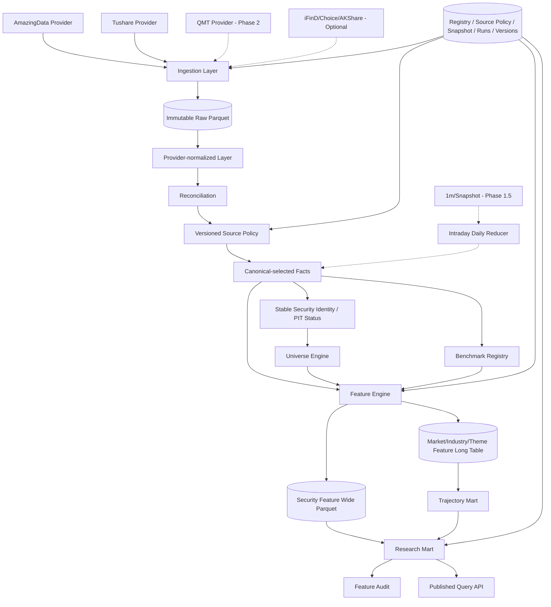

# A股市场态势数据基座（日频模块）V1.3.2 开发方案

> 文档目标：指导从 0 到 1 建设一个可复现、可审计、可扩展、松耦合的 A 股市场态势数据基座。V1.3.2 为**冻结施工基线（Frozen Baseline）**，以日频 Foundation MVP 为第一交付目标，同时为分钟增强与实时模块预留统一数据契约。
>
> 版本：V1.3.2 Frozen Baseline  
> 编制日期：2026-08-21  
> 适用阶段：Phase 0（日频 Foundation MVP）→ Phase 1（完整日频态势）→ Phase 1.5（日内数据压缩成日频事实）→ Phase 2（实时态势）  
> 设计原则：先事实、后特征、再状态、最后策略；Provider 可替换；语义标签不作为核心事实；不以“总情绪分数”为核心产物。

---

## 0. 执行摘要

本系统定位不是“预测大盘明天涨跌”，也不是“输出一个市场情绪分数”，而是建设一个 **A股市场态势数据基座（Market State Data Foundation）**。系统应稳定产出市场、行业、题材等层级的多维连续状态数据，并保证任意一个值可追溯到原始行情、数据源、计算公式、参数版本、Universe 版本、Benchmark、数据快照和可得时点。

### 0.1 V1.3.2 相对 V1.3.1 的终审冻结修订

V1.3.2 不新增市场功能域，只修复终审发现的 1 个 P0、6 个 P1 以及由此引出的对称性/一致性问题，并在定向复核通过后冻结：

1. **全部 Feature 输出统一 Artifact 身份**：`feature_artifact_set_id` 从“证券 Parquet 文件集”提升为“一次 Feature 计算的不可变输出批次”；Market/Industry/Theme 长表行同样绑定 Artifact Set 并纳入唯一键，Patch 重算不覆盖旧 Publish。
2. **Published/Exact 读取对称化**：长表默认按 `publish_id → feature_artifact_set_id` 选择行，宽表按同一 Artifact Set 解析文件；同一输入 Snapshot 可存在多个 Patch 计算批次且旧 Publish 精确复现。
3. **收益口径二维化**：把“是否含分红”的 `return_definition` 与“数学表示”的 `return_convention` 分离；Group 日收益先用 SIMPLE 横截面聚合并链成 synthetic NAV，时间序列 Trend 可使用 LOG；Relative Return 禁止跨表示空间直接相减。
4. **ZR 单一事实源**：`ZR` 仅作为 `PV_PRICE_RESPONSE_020` 的数学别名，不再形成第二个 Feature 实现；RAD/Breadth/Stress 统一依赖该正式 Feature。
5. **Security Identity 发布后冻结**：首次正式 Publish 后，任何供应商 `list_date` 等身份字段修订不得触发 re-key；更正记录进入 Errata/DQ，已发布 `security_id` 永久稳定。
6. **ATTN_BREADTH_P80 依赖修正**：`PV_TURNOVER_PCT_250` 只基于 `PV_TURNOVER_F/turnover_rate_f` 自身历史分位，不错误依赖 turnover ratio。
7. **DuckDB 灾备闭环**：增加 `atlas.duckdb` 每日一致性快照与“删除工作库后恢复 Published/Exact 语义”的重建演练。
8. **Publish 状态机与事务**：`PUBLISHED / SUPERSEDED / WITHDRAWN` 明确定义；同一交易日正式重发时，旧 Publish 降为 SUPERSEDED，新 Publish、Universe 映射和 Pipeline 状态必须在同一 DuckDB 事务提交。

终审 P2 项统一进入 Backlog，不扩大冻结基线；V1.3.2 通过定向复核后不再进行第四轮全文架构评审。

### 0.1A V1.3.1 相对 V1.3 的施工前闭环修订

V1.3.1 不新增新的市场功能域，重点吸收第二轮外部评审中会导致错误查询语义、架构返工、数据源锁定和不可复现的意见，并把已知内部矛盾清零：

1. **证券宽表 Published Read Contract 补齐**：证券级 Base/Derived Feature Parquet 只能按 `publish_id/feature_artifact_set_id → meta_feature_artifact_component.file_uri` 精确解析文件集合，禁止目录 glob 作为正式读取路径；Notebook 提供官方 Helper。
2. **Base / Derived Feature / Presentation Trajectory 正式分层**：凡是会被其他 Feature 依赖的历史 percentile、z/rank 等，注册为 `DERIVED Feature` 并进入 DAG；只有不作为计算输入的 delta/velocity/duration/展示 percentile 才属于 Trajectory Read Model。
3. **AmazingData 前置 Provider Spike**：在正式 Phase 0 开发前增加 `P0-M-1 Go/No-Go`，验证历史状态、退市、涨跌停、复权、单位、权限和历史覆盖；同时提前定义 Tushare FUSED fallback。
4. **确定性 Security ID**：统一采用版本化 UUIDv5 规则，由 `exchange + asset_type + initial_symbol + first_list_date` 生成；禁止随机 UUID/自增序列作为跨环境身份。
5. **Phase 0 内部拆为 P0a/P0b**：P0a 先跑通 AmazingData 行情/状态的最小纵贯线；P0b 再接入 Tushare Essential、SW、Reconciliation 和完整 Source Policy，降低双 Adapter 同时集成风险。
6. **Benchmark 金融口径补齐**：明确 `PRICE_RETURN / TOTAL_RETURN`，自聚合 Benchmark 由 `universe + version + weighting + return_definition` 完整定义；指数行情同样纳入 Reconciliation / Source Policy。
7. **Source Policy 治理补齐**：有效期不得重叠、切换先 Dry-run、Backfill 期间锁定 policy version、容差规则结构化并版本化。
8. **Canonical 事实所有权裁决**：Limit、Security Status、Corporate Action 三域不再复制权威字段；limit price 只来自 limit fact，ST/停牌来自 status fact，除权除息事件来自 corporate action。
9. **Publish 多 Universe 规范化**：`meta_publish_snapshot` 不再用单一 `universe_version`，改用子表 `meta_publish_universe` 记录一个 Publish 对应的全部 Universe 版本。
10. **Group synthetic series 入模**：新增 `meta_series_definition`，Group SER/RET 等必须显式声明 EW/MEDIAN/AWR/FLOAT_MV 等输入序列口径。
11. **RAD_LIMIT_NORM 完整合法域**：明确使用原始 `close/pre_close-1` 收益，加入 denominator 合法域与 `NO_LIMIT` 桶，保证全桶 share 可校验。
12. **性能/SLA 与运维补齐**：定义 16C/64GB/2TB NVMe 参考机、冷启动回补口径、EOD P95/P99 SLA、磁盘水位驱动 Staging 清理、CI 与真实 Provider SDK/Secret 隔离。
13. **12 项残余一致性问题清零**：Benchmark 主键、Feature 长表完整唯一键、Provider Symbol 日有效唯一性、Benchmark 缺失降级语义、Intraday 时间类型等全部统一。
14. **仍不提前引入**：Iceberg/Delta、复杂滑动 percentile 数据结构；首次需要多写者或自动 GC 时再触发 ADR-006。

V1.3 已完成的 Phase 切割、AmazingData/Tushare Provider-neutral 架构、语义标签降级、Benchmark 入模、退市闭环、RAD 制度归一与 Phase 1.5 日内压缩层全部保留。

### 0.2 四阶段交付边界

| 阶段 | 目标 | 必做 | 明确不做 |
|---|---|---|---|
| **Phase 0 Foundation MVP** | 证明数据地基可重建、可复算、可追溯 | AmazingData + Tushare 必要 Adapter、Canonical、PIT Security、Universe、Benchmark、SW L1、Trend/PV、Market/Industry Mart、Snapshot/DQ | Theme、完整 Audit、Experiment、UI、分钟 Feature、实时 |
| **Phase 1 Daily State Foundation** | 形成完整日频 Market State Matrix | Breadth/Volatility/Stress/RAD/Rotation、Trajectory Mart、Feature Audit、Theme Membership/聚合、API | 实时计算、全量 Tick/L2 |
| **Phase 1.5 Intraday-derived Daily** | 用历史分钟/快照增强日终状态 | 1m/Snapshot → 日级压缩事实、涨停路径、早晚盘结构、增量审计 | 盘中在线状态机 |
| **Phase 2 Realtime** | Daily Prior + Intraday State Transition | AmazingData/QMT 实时流、事件语义、实时 Feature、必要时 ClickHouse/Redis/消息流 | 未证实有价值的全市场 L2 永久存储 |

### 0.3 Phase 0 只实现一条纵贯线

```text
AmazingData + Tushare Essential Providers
                ↓
              Raw
                ↓
        Provider-normalized
                ↓
      Source Policy Selection
                ↓
           Canonical Facts
                ↓
 Stable Security ID + PIT Status
                ↓
        ALL_A / CORE_TRADABLE
                ↓
        Security Trend + PV
                ↓
       Market + SW L1 Aggregate
                ↓
          Daily Research Mart
                ↓
           Atomic Publish
```

Phase 0 的成功标准不是“功能很多”，而是：任意历史日期可重建、任意 Feature 可追溯、退市股不丢失、同一 Snapshot 重跑一致、发布失败不污染 latest。

### 0.4 核心 Feature 域

完整日频态势仍采用以下核心域：

1. **Trend**：方向、强度、广度、延续性、多周期一致性；
2. **Price–Volume**：成交活跃、收益-成交分布、价格位置、成交成本、价格响应、量价效率、Attention；
3. **Breadth**：市场参与面、收益横截面、成交额横截面、尾部结构、参与集中度；
4. **Volatility**：时间序列波动、日内区间波动、横截面离散、下行波动、波动状态；
5. **Stress**：弱势尾部、亏损成交、回撤广度、新低、跌停压力、风险扩散。

Risk Appetite、Style、Payoff/Feedback、Tradability、Positioning/Leverage、ETF、衍生品、供给压力、宏观与事件继续作为扩展域，不污染基础 Fact/Feature。

### 0.5 原型技术栈

- **Python 3.12+**：数据处理、特征计算、审计；
- **Parquet**：Raw / Provider-normalized / Canonical / Security Feature 持久化；
- **DuckDB**：元数据、查询、市场/行业/题材长表、Mart；
- **FastAPI**：Phase 1 起提供已发布数据查询；
- **Typer CLI**：回补、单日计算、审计、运维；
- **pytest + Pandera/Pydantic**：单元测试、数据契约、Golden Test；
- **Polars / NumPy / DuckDB SQL**：批量 Feature 生产实现；
- **Streamlit**：仅 Phase 1 后可选，不进入 Foundation MVP 关键路径。

Phase 0 明确**不引入 Kafka、Flink、Airflow、Kubernetes、Iceberg/Delta 强依赖、微服务集群**。所有模块通过接口隔离，后续可替换存储/调度层而不修改 Feature 数学语义。

### 0.6 文档治理

- 主设计文档只保存稳定架构和契约；
- 数据商当前接口、权限、积分、版本、已验证字段放入 `docs/provider_verification/`；
- 重大设计决策进入 `docs/adr/`；
- 风险集中维护在 `docs/risk_register.md`；
- 术语维护在 `docs/glossary.md`；
- 版本变化记录在 `docs/changelog.md`。

### 0.7 V1.3.2 冻结状态与变更纪律

V1.3.1 终审发现的唯一 P0（Group Feature 长表缺输出 Artifact 身份）及其一致性影响已在 V1.3.2 修复；终审 P1 条款级问题也已一并闭环。V1.3.2 经定向复核后作为 **Frozen Baseline**：

1. 不再以“继续完善总体设计”为由增加 Phase 0 功能；
2. 新想法先进入 Backlog / ADR，只有发现新的 P0（未来函数、幸存者偏差、版本混读、不可复现、数据源锁定或必然大规模返工）才允许修改冻结基线；
3. 下一工程动作固定为 `P0-M-1 Provider Spike → P0a → P0b`；
4. 实际 Provider 联调结果优先更新 `docs/provider_verification/`，不因供应商字段/权限变化频繁修改主架构文档；
5. V1.3.2 的详细终审吸收与定向复核结论见第 44–45 节。

---

# 1. 系统目标与非目标

## 1.1 核心目标

系统必须支持以下研究问题：

- 当前全A市场是普涨、结构性上涨、单主线、快速轮动、全面退潮还是高分歧？
- 当前趋势是否只是价格上涨，还是具备广度和延续性？
- 成交主要发生在上涨股票、下跌股票还是极端尾部股票？
- 同样的成交放大，在低位启动、高位加速、高位钝化时有何不同？
- 当前哪些行业、题材正在吸收超额交易注意力？这种关注是否得到价格、广度和持续性的确认？
- 行业/题材强势是龙头集中还是内部扩散？
- 昨日强势股票/板块今日是否获得溢价，即市场当前“奖励什么行为”？
- 当前波动和压力是局部还是正在扩散？
- 不同 Benchmark 下的相对强弱是否一致？大盘权重与普通股票是否背离？
- 后续任意策略能否从历史态势矩阵中选取特定 Feature 做条件研究，而无需重写底层数据工程？

## 1.2 非目标

V1.3 不以以下事项为首要目标：

- 不直接输出“买/卖”信号；
- 不把所有维度强行合成为一个总分；
- 不在未审计前宣称某指标具有预测能力；
- 不使用无法解释、无法稳定获得、或历史 Point-in-time 不可信的数据作为核心依赖；
- 不把供应商“主力资金流”“热点分数”“涨停原因”等加工结论当作核心事实；
- 不因为拥有分钟数据就把 Phase 0 做成分钟系统；
- 不在 Foundation MVP 引入重型实时架构或复杂 table format；
- 不使用“主力吸筹/出货”等无法由可观测事实直接证明的主观标签。

## 1.3 数据对象优先级

系统按以下优先级使用信息：

```text
DIRECT_OBSERVATION
    交易所/行情直接观测
        ↓
DERIVED_FACT
    由可观测数据按固定公式计算
        ↓
PROVIDER_DERIVED
    数据商加工字段，可审计后使用
        ↓
SEMANTIC_LABEL
    人工题材/原因/叙事，只作上下文
```

默认 CORE Feature 只允许依赖 `DIRECT_OBSERVATION` 与 `DERIVED_FACT`。`PROVIDER_DERIVED` 需单独记录来源与版本；`SEMANTIC_LABEL` 默认不得直接驱动 CORE State。

---
# 2. 设计总原则（研究宪法）

以下原则建议作为项目不可违反的规范。

## 2.1 分层原则

数据严格分为：

```text
Fact / Raw Observation
        ↓
Canonical Data
        ↓
Feature
        ↓
State / Regime
        ↓
Strategy Research
```

- Fact 层只陈述事实；
- Feature 层进行可重复的数学加工；
- State 层才做状态解释；
- Strategy 层负责未来收益/风险研究。

禁止在 Fact/Feature 层写入“看多”“看空”“高潮”“退潮”等策略化结论。

## 2.2 描述与预测分离

例如：

- `MA20_BREADTH = 0.72` 是事实型 Feature；
- “趋势广度扩张”是 State；
- “因此 T+5 上涨概率更高”必须由独立历史实验支持。

## 2.3 Point-in-time 原则

任何历史回测只能使用当时已经可得的数据。

每个 Canonical / Feature 记录至少保留：

- `trade_date`
- `available_at`
- `ingested_at`
- `provider`
- `data_version`
- `calc_run_id`

对历史回补无法获得真实抓取时刻的数据，使用 **保守可得时间规则**，例如：

- A股 `daily`：文档显示交易日约 15:00–16:00 入库，历史回测默认 `available_at = 16:10`；
- `daily_basic`：文档显示约 15:00–17:00 更新，历史回测默认 `available_at = 17:10`；
- `stk_limit`：当日约 08:40 更新，可在盘前作为已知交易制度边界使用；
- 实际在线运行后，优先记录真实 `observed_at/ingested_at`。

默认 EOD 信号时点建议设为 **17:30 Asia/Shanghai**，避免使用尚未完全更新的数据。

## 2.4 复权规则

- 多日收益、趋势、均线、价格位置、新高新低：使用连续复权价格；
- 当日 K 线结构（CLV、振幅）：使用当日原始 OHLC；
- 涨跌停判断：使用当日真实 `up_limit/down_limit`；
- 不依赖固定 `±10%/±20%` 规则。

建议内部统一构造：

```text
adj_open  = open  * adj_factor
adj_high  = high  * adj_factor
adj_low   = low   * adj_factor
adj_close = close * adj_factor
```

该绝对尺度可任意，但比值/收益保持连续。若需要展示前复权价格，再单独按最新因子归一，不影响 Feature 计算。

## 2.5 成交单位统一

Tushare A股日线：

- `vol` 原始单位为“手”；
- `amount` 原始单位为“千元”。

Canonical 层统一转换：

```text
volume_shares = vol * 100
amount_cny    = amount * 1000
```

Feature 层不得直接使用 Provider 原始单位。

## 2.6 市场聚合必须保留多视角

市场/行业/题材聚合至少同时保留：

1. `equal_weight_return`：成分股等权；
2. `median_return`：横截面中位数；
3. `amount_weighted_return`：当日成交额加权（描述性，不解释为资金流）；
4. `float_mv_weighted_return`：使用 T-1 流通市值权重。

避免单一指数掩盖普通股票真实体验。

## 2.7 连续值优先

必须保存连续值，再派生 Percentile / State。

禁止只保存：

```text
rotation_state = "fast"
```

而不保存：

```text
rank_persistence = 0.23
attention_rotation = 0.41
```

## 2.8 参数不因样本最优而固定

优先研究具有经济意义的窗口：`5 / 20 / 60 / 250` 交易日。

若历史最优参数为 17 日、43 日等，必须验证其周围参数是否存在稳定平台（Parameter Plateau），否则按过拟合处理。

## 2.9 可复现快照与派生产物原则

任何 Feature/Experiment 不允许只引用“当前数据库”。输入与输出分别绑定不可变身份：

- `data_snapshot_id`：本次计算实际读取的 Canonical 输入数据集、分区/文件、Source Policy、Schema 和内容 Hash；
- `feature_artifact_set_id`：由该输入 Snapshot 在某个 Feature Set/代码/参数下生成的**全部 Feature 派生输出批次**身份；既覆盖证券宽表 Parquet，也覆盖 MARKET/INDUSTRY/THEME 长表行集。文件型产物通过 Artifact Component Manifest 枚举，长表行通过 `feature_artifact_set_id` 归属同一不可变批次；
- `publish_id`：把输入 Snapshot、Feature Artifact Set、Feature Set、Universe 版本集合和 Mart 版本组合成用户可见的一次正式发布。

因此复现条件至少是：

```text
publish_id（若复现正式发布）
data_snapshot_id
feature_artifact_set_id（正式 Feature 输出均必须存在）
source_policy_version
universe_id + universe_version
feature_version + param_set_id
benchmark_id + benchmark_version（相对类）
series_definition_id + version（Group序列类）
code_commit
environment_lock_hash
```

`data_version` 只表示某张表/数据集的版本，**不能替代跨数据集一致性输入快照**。Manifest/文件内容默认使用 SHA-256；Hash 算法作为 Manifest 格式版本的一部分。Manifest Hash 使用**逻辑组件键 + content_hash + schema_hash**排序后计算，不把机器绝对路径作为内容语义，避免同一内容迁移目录后 Hash 无意义变化。

## 2.10 原子发布原则

日终生命周期分层：

```text
Input Snapshot      : STAGING → DATA_VALIDATED（随后输入组件封存）
Feature Artifact Set: STAGING → FEATURE_VALIDATED（随后输出批次封存；文件清单与长表行归属均不可变）
Pipeline/Publish    : RUNNING → FEATURE_VALIDATED → PUBLISHED
```

`PUBLISHED` 属于 `meta_publish_snapshot/meta_pipeline_run` 的用户可见状态，不把 Feature 输出追加回已经封存的 `data_snapshot`。只有 `status=PUBLISHED` 的 `publish_id` 才允许被 API 的 `latest`、Dashboard 或普通研究默认读取。失败/降级批次可以保留用于审计，但不得覆盖上一个成功 Publish。

## 2.11 数据修订不可静默覆盖

供应商可能补录或修订历史数据。Raw 层必须 append-only；同一 `provider + dataset + business_key` 若内容发生变化，新增 revision，并记录：

```text
first_seen_at
last_seen_at
revision_no
content_hash
replaces_revision_no
```

Canonical 重建后生成新的 `data_snapshot_id`。旧实验必须绑定原 `publish_id` 或 `feature_artifact_set_id + data_snapshot_id`，不允许历史结果因供应商修订或 Patch 重算被静默改变。

## 2.12 确定性计算原则

同一快照、相同代码和参数必须得到相同结果。所有会影响数值结果的细节——排序、分位数算法、标准差自由度、Rank Tie、缺失值、滚动窗口、时区——必须在第 9 节统一规定，不允许依赖 pandas/DuckDB 默认值。

---

## 2.13 Provider-neutral 与 Source Policy 原则

系统没有“永久总主源”。Provider 只负责提供候选事实；正式 Canonical 由版本化 `Source Policy` 决定。策略/Feature 代码不得出现 `if provider == "tushare"` 等来源分支。

Source Policy 必须回答：

```text
canonical_dataset / canonical_field_or_group
candidate_providers
selection_scope        DATASET | FIELD
priority
point_in_time_grade
observation_type       DIRECT_OBSERVATION | DERIVED_FACT | PROVIDER_DERIVED | SEMANTIC_LABEL
tolerance_rule_id
fallback_policy
conflict_action
source_policy_version
valid_from / valid_to
```

默认优先 **Dataset Atomicity**：OHLCV 等一个业务记录尽量来自同一 Provider，禁止为了“补齐字段”无审计地把同一根 K 线拼成多源混合记录。只有显式登记为 `FUSED_DATASET` 的 Canonical Dataset 才允许字段级组合。

Source Policy 是受治理配置，不是运行时随意开关：

- 同一 `canonical_dataset + field_or_group` 的有效期不得重叠，重叠写入直接 `BLOCK`；
- 版本切换前必须运行 Dry-run，输出受影响日期/实体/字段、抽样 Diff、预计 Revision 数；
- 长周期 Backfill 在 `pipeline_run` 启动时锁定 `source_policy_version`，同一批次中途禁止切换；
- `tolerance_rule` 不使用自由文本，统一引用结构化 `meta_tolerance_rule`；
- Provider Verification 未通过前，Source Policy 中的 Primary 只能标记为 `CANDIDATE`，不得进入正式 `PUBLISHED` 配置。

## 2.14 Benchmark 必须显式

任何 `REL_RET / RS / EXCESS_RETURN / RANK` 等相对指标必须通过 `benchmark_id + benchmark_version` 明确基准。禁止在代码中默认“market_return”而不说明它是：

- `ALL_A_EQUAL_WEIGHT`；
- `ALL_A_FLOAT_MV`；
- 中证全指等官方指数；
- 或其他明确注册的 Benchmark。

Benchmark 同时必须声明收益定义：

```text
PRICE_RETURN
TOTAL_RETURN
```

若资产侧使用含分红连续复权收益，而 Benchmark 是价格指数，必须在 Registry 的 `known_bias` 标记口径差异；有可靠全收益指数时作为独立 `benchmark_id` 注册，禁止把价格指数静默当作全收益指数。

`MARKET_AGGREGATE` Benchmark 不允许使用模糊 `aggregate_id`：必须能解析到 `universe_id + universe_version + series_definition_id/weighting_method + return_definition`。Benchmark 是 Feature 参数和血缘的一部分，改变 Benchmark 必须产生新的参数集或 Feature 语义。

## 2.15 Base Feature、Derived Feature 与 Presentation Trajectory 分离

核心计算层正式区分三类对象：

```text
BASE FEATURE
  直接由 Canonical Fact/已注册上游 Feature 计算的稳定数学量

DERIVED FEATURE
  由 Feature 历史序列派生，且会作为其他 Feature / Group Aggregation 的计算输入
  例如：PV_TURNOVER_PCT_250、VOL_CC_020_PCT_250

PRESENTATION TRAJECTORY
  仅用于读模型/状态展示，不作为其他 CORE/CANDIDATE Feature 的输入
  例如：delta、velocity、acceleration、duration、展示性 percentile/smoothing
```

**判定规则：只要一个 percentile/z/rank/平滑值被另一个 Feature 依赖，它就不是“Mart 临时派生”，而必须升级为正式 DERIVED Feature**：拥有独立 `feature_id/version`、Registry、DAG 依赖、Snapshot 血缘、Golden Test，并与 Base Feature 一样受 Published Read Contract 管理。

Feature 主表/证券宽表只保存 BASE/DERIVED Feature 的稳定值与必要上下文；Presentation Trajectory 统一在可重建 Mart/Read Model 中生成。这样既避免 Schema 因 `delta_10d` 等展示需求膨胀，也不会让 `ATTN_BREADTH_P80`、`VOL_BREADTH_P80` 等聚合 Feature 在实现期临时重算证券分位数。

## 2.16 时间分辨率是一等元数据

“同名概念”在不同频率下不是同一条记录。Registry 必须包含：

```text
frequency
observation_window
aggregation_window
baseline_frequency
```

例如 `ATTN_LEVEL@1D` 与 `ATTN_LEVEL@5m` 可以属于同一概念族，但必须具备独立版本和基准分布。

## 2.17 先日频事实，再日内压缩，再实时

第一阶段“日频”表示**最终发布频率为日频**，并不限制未来只能使用日线输入。Phase 1.5 允许将完整 1 分钟/Snapshot 历史压缩成日级 Fact；只有证明这些日内事实具有状态或策略增量价值后，才将同一语义迁移到 Phase 2 实时计算。

---

# 3. 原型系统总体架构

## 3.1 架构图



## 3.2 模块边界

### `providers`

V1.3 将 Provider 拆为 `reference / batch_market / intraday_history / realtime_market` 四类能力。Provider 只负责：

- 外部连接；
- Provider DTO；
- 原始单位/代码/时间解释；
- 来源级 freshness/quality；
- 不负责任何 Market Feature。

推荐目录：

```text
providers/
├─ base.py
├─ registry.py
├─ amazingdata/
├─ tushare/
├─ qmt/
├─ ifind/
├─ choice/
└─ akshare/
```

Phase 0 只要求实现：

```text
AmazingDataEssentialProvider
TushareEssentialProvider
```

QMT/iFinD/Choice/AKShare 只保留接口，不进入 Phase 0 关键路径。

### `canonical`

负责：Provider-normalized → Reconciliation → Source Policy Selection → Canonical。字段映射、单位、类型、去重、证券代码、时区、Source Provenance 全部在这一层完成。

### `identity`

负责内部 `security_id`、Provider Symbol 映射、上市/退市、交易规则与历史证券状态。Feature 不得自己解析代码或推断板块。

### `universe`

只回答“某日某证券是否属于某 Universe/行业/题材”。不得计算趋势等 Feature。

### `benchmarks`

管理官方指数和自聚合基准。所有相对收益 Feature 必须通过 Registry 显式引用 Benchmark。

### `features`

纯计算模块：输入 Canonical / 已注册上游 Feature / Universe / Benchmark，输出正式 BASE/DERIVED/GROUP Feature 值。不得直接调用 Provider。历史 percentile/z/rank 只有在被下游 Feature 依赖时才由本模块作为 DERIVED Feature 计算；纯展示 delta/duration 不属于本模块。

### `aggregation`

负责 SECURITY → MARKET / INDUSTRY / THEME 聚合，统一 `valid_n/effective_n/confidence` 语义。

### `trajectory`

仅生成不作为其他 Feature 输入的 Presentation Trajectory：展示性 percentile、delta、velocity、acceleration、duration、平滑版本；属于可重建 Mart/Read Model。任何被下游 Feature 依赖的 percentile/z/rank 必须在 `features` 中注册为 DERIVED Feature。

### `audit`

负责数据覆盖、分布、稳定性、冗余、增量信息、样本外和横截面样本量审计。

### `experiments`

Phase 1 才进入关键路径。负责 Forward Labels、条件分组、Walk-forward、Execution-aware 研究；不得修改 Feature 定义。

### `api`

Phase 1 起只读取 `PUBLISHED publish_id` 对应的 Input Snapshot / Feature Artifact / Mart。请求线程不触发 Feature 重算，且禁止裸读事实 Feature 表或目录 glob。

### `intraday_reducer`

Phase 1.5：把历史 1m / Snapshot 压缩为一天一条/少量日级事实，不在 Phase 0 启用。

## 3.3 原型运行拓扑与单 Writer 规则

```text
Scheduler / CLI
      ↓
Pipeline Worker
  ├─ Provider IO
  ├─ Canonical / Reconciliation
  ├─ Universe / Feature / Mart
  └─ Metadata Writer ─────→ atlas.duckdb [唯一写者]
                                ↑
FastAPI / Notebook / UI ────────┘        [只读]
```

DuckDB 原型采用单 Writer。Parquet 数据写入独立 staging 文件，经校验后变为不可变文件；DuckDB 单事务只登记已完成的文件和 Publish Pointer。

Phase 0 **不实现自动 GC**。旧 Raw/Canonical/Feature 文件只增不删；Staging 临时文件可按 run 状态清理。表格式升级由 ADR-006 单独评估。

## 3.4 Feature 依赖图

Feature Engine 必须根据 Registry 的 `depends_on_features/input_datasets/benchmark_id/series_definition_id` 构建 DAG 并拓扑排序。禁止依赖 Python 文件执行顺序，也禁止在 Group Aggregation 内部临时计算未注册的证券历史 percentile/z/rank。

```text
Canonical Daily Bar / Basic / Status / Benchmark
                    ↓
          Security BASE Feature
                    ↓
          Security DERIVED Feature
      （若其他Feature需要percentile/z/rank）
                    ↓
       Universe / Industry Membership
                    ↓
        Market / SW L1 GROUP Feature
                    ↓
             State Inputs

BASE/DERIVED/GROUP Feature Series
                    ↓
      Presentation Trajectory Mart
    delta / velocity / duration / display percentile
```

示例：

```text
Daily Basic
  → PV_TURNOVER_RATIO_020 [BASE]
  → PV_TURNOVER_PCT_250   [DERIVED]
  → ATTN_BREADTH_P80      [GROUP]

Daily Bar
  → VOL_CC_020            [BASE]
  → VOL_CC_020_PCT_250    [DERIVED]
  → VOL_BREADTH_P80       [GROUP]
```

Feature 计算接口必须接受 **Panel/Batch** 数据，禁止把“逐证券 Python 循环”作为生产实现契约；允许维护慢速 Reference Implementation 用于 Golden Test。

---
# 4. 推荐项目目录

```text
ashare-state-foundation/
├─ pyproject.toml
├─ README.md
├─ uv.lock / requirements.lock
├─ configs/
│  ├─ base.yaml
│  ├─ providers.yaml
│  ├─ source_policy.yaml
│  ├─ universes.yaml
│  ├─ benchmarks.yaml
│  └─ features/
│     ├─ trend_v1.yaml
│     ├─ price_volume_v1.yaml
│     ├─ breadth_v1.yaml
│     ├─ volatility_v1.yaml
│     └─ stress_v1.yaml
├─ data/
│  ├─ raw/
│  ├─ staging/
│  ├─ provider_normalized/
│  ├─ canonical/
│  ├─ features/
│  ├─ marts/
│  ├─ manifests/
│  └─ db/atlas.duckdb
├─ migrations/
├─ ops/
│  ├─ scheduler/
│  ├─ backup/
│  └─ health/
├─ src/ashare_state/
│  ├─ domain/
│  ├─ providers/
│  │  ├─ base.py
│  │  ├─ registry.py
│  │  ├─ amazingdata/
│  │  ├─ tushare/
│  │  ├─ qmt/
│  │  ├─ ifind/
│  │  ├─ choice/
│  │  └─ akshare/
│  ├─ ingestion/
│  ├─ reconciliation/
│  ├─ source_policy/
│  ├─ canonical/
│  ├─ identity/
│  ├─ benchmarks/
│  ├─ universe/
│  ├─ features/
│  │  ├─ base.py
│  │  ├─ reference/
│  │  ├─ trend.py
│  │  ├─ price_volume.py
│  │  ├─ breadth.py
│  │  ├─ volatility.py
│  │  └─ stress.py
│  ├─ aggregation/
│  ├─ trajectory/
│  ├─ intraday_reducer/
│  ├─ audit/
│  ├─ experiments/
│  ├─ state/
│  ├─ storage/
│  ├─ api/
│  └─ cli.py
├─ tests/
│  ├─ unit/
│  ├─ integration/
│  ├─ golden/
│  ├─ performance/
│  ├─ data_quality/
│  └─ timezone/
└─ docs/
   ├─ feature_dictionary.md
   ├─ data_contracts.md
   ├─ provider_mapping.md
   ├─ provider_verification/
   │  ├─ amazingdata.md
   │  ├─ tushare.md
   │  ├─ qmt.md
   │  └─ ...
   ├─ source_policy.md
   ├─ capacity_plan.md
   ├─ numerical_conventions.md
   ├─ deployment.md
   ├─ risk_register.md
   ├─ glossary.md
   ├─ changelog.md
   ├─ adr/
   └─ runbook.md
```

硬边界：

- `features/` 不得 import `providers/`；
- `features/` 不得 import Provider SDK；
- `api/` 不得裸查 Feature Fact 表；
- `provider_verification/` 的变化不应迫使主架构文档升级。

---
# 5. 数据存储策略

## 5.1 Raw 层

Raw 按 Provider 原样 append-only 保存，不覆盖历史版本。

```text
data/raw/provider=amazingdata/dataset=history_stock_status/fetch_date=2026-08-21/run_id=.../*.parquet
data/raw/provider=tushare/dataset=daily_basic/trade_date=2026-08-20/run_id=.../*.parquet
```

Raw 元数据至少包括：provider、endpoint、request params、fetched_at、row_count、schema_hash、content_hash、source_version（若可得）。

Provider 自己的缓存（如 AmazingData HDF5、QMT 本地数据）只视为 **Provider-side Cache**，不是本系统 System of Record。

## 5.2 Provider-normalized 层

每个 Provider Adapter 先输出统一列名/单位/时区，但仍保留 Provider 身份：

```text
provider
provider_dataset
provider_symbol
security_id
business_time/trade_date
canonical_candidate_fields...
source_revision
available_at
ingested_at
quality_flags
```

该层允许同一业务键同时存在多个 Provider 记录，用于 Reconciliation。

## 5.3 Canonical-selected 层

Canonical-selected 只包含经 `source_policy_version` 选择后的唯一事实。必须能回答：

```text
selected_provider
source_policy_version
source_revision
selection_reason
reconciliation_status
```

历史 Experiment 不能依赖“当前最新 Source Policy”，必须绑定 Snapshot 中的 policy version。

## 5.4 Feature / Mart 存储

```text
SECURITY Feature
  → 按 family/version 宽表 Parquet

MARKET / INDUSTRY / THEME raw Feature
  → 长表

Trajectory / Percentile / State Input
  → Mart
```

证券级 Feature 不使用通用 EAV 长表；市场/行业/题材因为实体数量小，继续采用长表方便版本治理。

## 5.5 Parquet 分区与文件大小

- Raw：`provider/dataset/date-or-period/run_id`；
- Provider-normalized：`dataset/year/month/provider`；
- Canonical Daily：`dataset/year/month`；
- Security Feature：`family/version/year/month`；
- Mart：`version/year/month` 或按实际查询基准调整；
- Phase 1.5 分钟 Raw：优先 `provider/dataset/trade_date`；
- Phase 2 Tick/L2：另行按真实吞吐设计。

目标 Parquet 单文件通常约 `128MB–1GB`，避免大量几十KB小文件；Compaction 生成新不可变文件并切换 Manifest，不原地改已发布文件。

## 5.6 Staging 与原子提交

输入数据与派生 Feature 分别封存，最后由 Publish Pointer 原子暴露：

```text
A. Canonical Input
1. 写 data/staging/<run_id>/canonical/...
2. 校验 schema/row_count/hash/quality
3. fsync/close 并移动“单文件”到最终不可变路径
4. DuckDB 单事务登记 meta_data_snapshot/component
5. DATA_VALIDATED：封存 input component 集合与 data_manifest_hash

B. Feature Output
6. 基于已封存 data_snapshot_id 创建新的 `feature_artifact_set_id`，计算 Feature；证券级输出写 staging files，Group 长表写入带该 Artifact ID 的未发布行集
7. 校验 Feature schema/hash/Golden/DQ，并对长表行集计算确定性 rowset hash
8. 移动证券 Feature 单文件到最终不可变路径
9. 登记 meta_feature_artifact_set/component，并确认长表行全部归属同一 Artifact Set
10. FEATURE_VALIDATED：封存文件 component + 长表 rowset 的整体 artifact_manifest_hash；该批次之后禁止 UPDATE/UPSERT

C. Publish
11. 构建/校验 Mart 与 publish universe 映射
12. 单一 DuckDB 事务内：必要时旧 Publish `PUBLISHED→SUPERSEDED`；写新 `meta_publish_snapshot(status=PUBLISHED)`、`meta_publish_universe`；更新 `meta_pipeline_run.status=PUBLISHED`；最后切换 latest 可见性
```

**禁止依赖目录级 rename 的原子性**；Windows/Linux 都按“单文件已完成 + 元数据指针最后切换”设计。任何步骤失败，`latest` 仍指向上一成功 Publish。

## 5.7 Phase 0 数据保留策略：不做自动 GC

Phase 0：

- Raw/Canonical/Feature 已发布文件不自动删除；
- Staging 失败任务默认保留 7–30 日用于排障，但**磁盘水位优先于保留天数**；
- 临时研究 Mart 可设 TTL；
- 不实现“跨全部元数据引用扫描 + 自动删除”复杂 GC。

Staging 清理最低水位策略：

```text
WARN  : free_disk < max(20% total_disk, 200GB)
CLEAN : free_disk < max(15% total_disk, 150GB) → 优先清理已确认无用的 FAILED/CANCELLED staging
BLOCK : free_disk < max(10% total_disk, 100GB) → BLOCK 新 Backfill/大重算，仅允许恢复/清理
```

阈值可配置，且清理只能作用于未发布 Staging/明确 TTL 临时 Mart；**不得因为磁盘不足删除任何已发布 Snapshot 引用的 Raw/Canonical/Feature 文件**。

原因：50–150GB 级日频数据远没有达到必须靠复杂 GC 控制成本的程度，先避免误删和自研 table format 风险。

## 5.8 Table Format ADR-006

在**首次需要多写者、自动 GC、对象存储上的高频时间旅行或跨机并发提交**时触发评估，而不是按固定版本号机械启动：

```text
Option A  Immutable Parquet + Cross-dataset Snapshot Manifest
Option B  Delta Lake
Option C  Apache Iceberg
```

评估维度：本地/对象存储、DuckDB兼容、时间旅行、Schema演进、Windows部署、并发、维护复杂度。即使未来使用 Delta/Iceberg，跨多个数据集的一次研究知识状态仍需要 `meta_data_snapshot`。


## 5.9 Snapshot / Feature Artifact 读取契约

输入知识状态与 Feature 输出批次采用**两个不可变身份域**，避免把“用于计算的 Canonical 输入”和“计算后的输出版本”混成一个会自我扩张的 `data_snapshot_id`：

```text
Canonical Input
  data_snapshot_id
      ↓
  meta_data_snapshot_component

Feature Output Batch
  feature_artifact_set_id
      ├─ Security/file outputs
      │    ↓ meta_feature_artifact_component → exact file_uri list
      └─ Group/bucket long-table outputs
           ↓ fact_feature_value_daily / fact_feature_bucket_daily
             WHERE feature_artifact_set_id = target

Publish
  publish_id
      ↓ binds data_snapshot_id + feature_artifact_set_id
```

正式读取规则：

1. Canonical Reader：`data_snapshot_id → meta_data_snapshot_component.file_uri`；
2. Security/file Feature Reader：`publish_id/feature_artifact_set_id → meta_feature_artifact_component.file_uri`；
3. Group/bucket Feature Reader：`publish_id → feature_artifact_set_id → 长表 artifact filter`，不得仅按 `data_snapshot_id` 读取；
4. API、Mart Builder、正式研究代码、Notebook Helper **禁止使用目录 glob 直接读取 Published Canonical/Feature，也禁止裸查 Feature 长表后自行猜版本**；
5. 目录分区仅用于组织和性能，不表达版本语义；同一目录允许不同 Snapshot/Artifact Set 文件并存；
6. 默认读取使用 `latest PUBLISHED publish_id`；历史研究绑定 `publish_id`，或显式指定 `feature_artifact_set_id`；Artifact Set 自身可反查唯一输入 `data_snapshot_id`；
7. Raw 探索/Provider 调试可使用目录扫描，但不得把扫描结果直接作为正式 Feature 输入。

官方 Helper 至少提供：

```python
resolve_data_snapshot_files(data_snapshot_id, dataset)
resolve_feature_artifact_files(feature_artifact_set_id, layer, family)
load_published_security_features(family, date_range, securities=None)
load_security_features_for_publish(publish_id, family, date_range, securities=None)
load_feature_values_for_publish(publish_id, filters=None)
load_feature_buckets_for_publish(publish_id, filters=None)
```

任何自行拼接目录字符串、`MAX(data_snapshot_id)`、或只按输入 Snapshot 查询 Feature 输出的做法都不属于受支持读取路径。

---
# 6. 核心数据库设计

V1.3 默认逻辑类型：ID/代码 `VARCHAR`，股数/成交量 `BIGINT`，金额/价格/Feature `DOUBLE`，事件时点 `TIMESTAMPTZ`（物理统一 UTC），交易日 `DATE`。API/展示层再转 `Asia/Shanghai`。

## 6.0 Canonical 公共治理列

所有 Provider-normalized / Canonical 核心事实必须可追溯：

```text
provider
provider_dataset
source_revision
observation_type       DIRECT_OBSERVATION / DERIVED_FACT / PROVIDER_DERIVED / SEMANTIC_LABEL
availability_kind      OBSERVED / CONSERVATIVE_ASSUMED
available_at            TIMESTAMPTZ UTC
ingested_at             TIMESTAMPTZ UTC
data_version
schema_version
source_policy_version   selected层必需
quality_flags
```

历史回补的保守可得时间不能伪装成真实抓取时刻。

## 6.1 `meta_data_source`

| 字段 | 类型 | 说明 |
|---|---|---|
| source_id | string PK | `amazingdata.history_stock_status` |
| provider | string | amazingdata/tushare/qmt/ifind/choice/akshare/other |
| dataset | string | Provider 数据集 |
| history_start | date nullable | 已验证历史起点 |
| update_policy | string | EOD/PREOPEN/IRREGULAR/STREAM |
| conservative_available_time | time nullable | 历史 PIT 保守规则 |
| point_in_time_grade | string | A/B/C |
| observation_type | string | DIRECT/DERIVED/PROVIDER_DERIVED/SEMANTIC_LABEL |
| permission_note | string nullable | 权限/积分/终端条件 |
| verified_at | timestamptz | 最近联调 |
| note | string | 风险说明 |

不再使用 `primary_flag` 表示“总主源”；正式选择由 `meta_source_policy` 管理。

## 6.2 `dim_security`

| 字段 | 类型 | 说明 |
|---|---|---|
| security_id | string PK | 内部稳定、确定性代理键 |
| identity_key_version | string | `SECURITY_IDENTITY_V1` |
| symbol | string | 展示用当前本地代码 |
| initial_symbol | string | 首次识别代码，用于身份构造 |
| exchange | string | SSE/SZSE/BSE |
| current_name | string | 当前名称，仅展示 |
| asset_type | string | STOCK/ETF/INDEX/... |
| board | string | MAIN/CHINEXT/STAR/BSE/... |
| list_date | date |
| delist_date | date nullable |
| currency | string | CNY |
| active | bool |

删除 `provider_code`。供应商代码只能通过 `bridge_security_provider_symbol` 获取。

### 确定性 Security ID 规则（ADR-002）

Phase 0 禁止随机 UUID、数据库自增序列或任一 Provider Symbol 直接作为跨环境主键。V1 统一：

```text
identity_key =
  normalize(exchange) + ":" +
  normalize(asset_type) + ":" +
  normalize(initial_symbol) + ":" +
  YYYYMMDD(first_list_date)

security_id = UUIDv5(PROJECT_SECURITY_NAMESPACE, identity_key)
```

- `first_list_date` 进入 identity key，用于处理未来代码复用；同一代码退市后重新上市/重新分配视为新的 Security Identity；
- Provider 的后续代码变更通过 `bridge_security_provider_symbol` 有效区间表达，不修改既有 `security_id`；
- 若历史源缺失 `list_date`，不得静默使用当前日期。可在 Spike/Quarantine 阶段按 `SECURITY_IDENTITY_V1_FALLBACK` 使用 `exchange + asset_type + initial_symbol + first_seen_trade_date` 并打 `IDENTITY_FALLBACK`；Phase 0 正式 PUBLISHED Universe 默认不允许未审批的 fallback identity。若后续获得可靠 list_date，应在首次正式发布前解决映射，不在已发布研究结果中静默换ID；
- 固定证券 Fixture 必须跨两次干净环境重建产生完全相同的 Security ID；
- **发布后身份冻结**：某 `security_id` 一旦被任一 `PUBLISHED` Snapshot/Publish 引用，其 `identity_key_version` 及参与 identity key 的 `exchange/asset_type/initial_symbol/first_list_date` 不得再修改并触发 re-key。供应商后续修订只记录为 Identity Errata / DQ 注释及 Provider Mapping 更正，不改变已发布 `security_id`；
- re-key 只允许发生在该 Security 首次正式 Published 之前。若发现“两个真实证券被错误合并为同一 identity”等重大身份错误，必须走显式数据迁移/新数据版本，不允许后台自动换 ID；
- DQ 必须断言：已被 Published Snapshot 引用的 Security，其 identity key 输入发生变化时 `BLOCK` 并要求人工裁决。

## 6.3 `bridge_security_provider_symbol`

| 字段 | 类型 | 说明 |
|---|---|---|
| security_id | string |
| provider | string |
| provider_symbol | string |
| valid_from | date |
| valid_to | date nullable | 不含该日 |
| mapping_version | string |
| verified_at | timestamptz |

唯一键：`provider, provider_symbol, valid_from`。

每日有效性 DQ 硬断言：对任一 `trade_date`，同一 `(provider, provider_symbol)` **最多只能映射一个 `security_id`**；发现有效区间重叠直接 `BLOCK`，不得自动选“最新一条”。

## 6.4 `dim_trade_calendar`

只保存事实：

| 字段 | 类型 |
|---|---|
| exchange | string |
| trade_date | date |
| is_open | bool |
| calendar_version | string |

PK：`exchange, trade_date, calendar_version`。

`prev_trade_date/next_trade_date` 使用 `lag/lead` 或 Mart 派生，避免日历修订产生级联物理更新。

## 6.5 `dim_trading_rule`

用于避免硬编码涨跌幅制度、价格最小变动单位和特殊无涨跌幅限制日：

```text
exchange
asset_type
board nullable
security_id nullable
valid_from
valid_to
price_tick
has_price_limit
up_limit_rule nullable
down_limit_rule nullable
rule_version
```

价格比较统一调用 Trading Rule，不在 Feature 内写死 `0.01`、`10%/20%/30%`。

## 6.6 `fact_daily_bar_provider`

Provider-normalized 行情事实：

| 字段 | 类型 | 说明 |
|---|---|---|
| security_id | string |
| trade_date | date |
| open/high/low/close/pre_close | double | 原始价格 |
| regular_volume_shares | bigint nullable | 常规时段 |
| regular_amount_cny | double nullable |
| after_hours_volume_shares | bigint nullable | 盘后定价等 |
| after_hours_amount_cny | double nullable |
| total_volume_shares | bigint | 最终总成交量 |
| total_amount_cny | double | 最终总成交额 |
| total_includes_after_hours | bool nullable |
| bar_finalized_at | timestamptz nullable |
| provider | string |
| source_revision | string |
| available_at | timestamptz |
| ingested_at | timestamptz |
| quality_flags | string/JSON |

唯一键：`security_id, trade_date, provider, source_revision`。

Phase 0 Feature 默认使用 `total_*`；若未来研究常规收盘与盘后分离，Feature Registry 显式指定字段。

## 6.7 `fact_adj_factor_provider`

```text
security_id
trade_date
adj_factor
provider
source_revision
available_at TIMESTAMPTZ
ingested_at TIMESTAMPTZ
quality_flags
```

## 6.8 `fact_daily_basic_provider`

| 字段 | 类型 | 说明 |
|---|---|---|
| security_id | string |
| trade_date | date |
| turnover_rate | double nullable | 统一小数比例 |
| turnover_rate_f | double nullable | 自由流通换手 |
| volume_ratio | double nullable |
| total_share | bigint nullable | 股 |
| float_share | bigint nullable | 股 |
| free_share | bigint nullable | 股 |
| total_mv_cny | double nullable |
| circ_mv_cny | double nullable |
| provider | string |
| source_revision | string |
| available_at/ingested_at | timestamptz |
| quality_flags | string/JSON |

Phase 0 当前优先由 Tushare `daily_basic` 提供 `turnover_rate_f/free_share/circ_mv`；AmazingData 股本数据用于交叉校验和替代可能性研究。

## 6.9 `fact_limit_price_provider`

涨跌停价格的唯一 Provider-normalized 权威事实表：

```text
security_id
trade_date
pre_close
up_limit nullable
down_limit nullable
has_price_limit
limit_rule_code nullable
provider
source_revision
available_at TIMESTAMPTZ
ingested_at TIMESTAMPTZ
quality_flags
```

AmazingData 历史证券状态可映射到本表；Tushare `stk_limit` 作为独立候选/校验源。**Canonical `up_limit/down_limit/has_price_limit` 只从本数据域产生，不从 Security Status 表重复取权威值。**

## 6.10 `fact_security_status_provider`

Provider-normalized 历史证券状态，只保存状态事实，不复制 limit/corporate-action 权威字段：

```text
security_id
trade_date
is_listed
is_suspended
is_st
trading_status_code nullable
is_delisting_period nullable
provider
source_revision
available_at TIMESTAMPTZ
ingested_at TIMESTAMPTZ
quality_flags
```

Phase 0 候选来源为 AmazingData `get_history_stock_status`；Tushare `namechange/suspend_d/stock_basic` 可组成 FUSED fallback。若 Provider 原接口同时返回 up/down limit 或除权除息标志，Raw/Provider DTO 可原样保存，但 Canonicalizer 分别路由至 `fact_limit_price_provider` / `fact_corporate_action`，不在本表形成第二个事实所有者。

## 6.11 `fact_security_status_daily`

Canonical-selected/derived 日状态：

```text
security_id
trade_date
is_listed
is_suspended
is_st
is_delisting_period nullable
has_bar
is_new_20d
is_new_60d
has_price_limit
is_one_word_up
is_one_word_down
is_limit_up_close
is_limit_down_close
history_days
selected_status_provider
selected_limit_provider
source_policy_version
quality_flags
```

其中：

- `is_listed/is_suspended/is_st/is_delisting_period` 来自 Status Domain；
- `has_price_limit/up_limit/down_limit` 的输入只来自 Canonical Limit Domain；
- 一字板/收盘涨跌停等为二者与 Daily Bar 的 DERIVED_FACT；
- 除权除息事件不在本表复制，查询需要时 join `fact_corporate_action`/日上下文 View；
- 价格相等使用 `price_tick` 容差，不使用浮点完全相等。

## 6.12 Canonical / Feature Selected Read Contract

Feature 不直接读取 `*_provider` 表。Canonical 正式接口：

```text
daily_bar_for_snapshot(snapshot_id)
adj_factor_for_snapshot(snapshot_id)
daily_basic_for_snapshot(snapshot_id)
limit_price_for_snapshot(snapshot_id)
security_status_for_snapshot(snapshot_id)
index_daily_for_snapshot(snapshot_id)
```

实现可为 DuckDB Macro/Table Function 或 Snapshot 物化 View。函数必须同时绑定 `data_snapshot_id + source_policy_version`。

证券级宽表同样纳入 Read Contract，但输出文件不塞回输入 `data_snapshot`：

```text
security_features_for_publish(publish_id, family, ...)
security_features_for_artifact_set(feature_artifact_set_id, family, ...)
published_security_features(family, ...)
```

其文件集合必须从 `meta_feature_artifact_component` 精确解析；目录 glob 不是版本选择机制。普通研究默认使用 PUBLISHED Helper，实验复现优先绑定 `publish_id`。

## 6.13 `dim_industry`

```text
industry_id PK
provider/taxonomy_owner
provider_code
level
name
parent_industry_id
taxonomy_version
```

允许同时存在 SW、Galaxy 等多套 taxonomy；不能把“一级/二级/三级”自动等同于申万。

## 6.14 `bridge_security_industry`

```text
security_id
industry_id
in_date
out_date nullable
provider
membership_version
point_in_time_grade
```

历史查询：

```text
in_date <= trade_date
AND (out_date IS NULL OR trade_date < out_date)
```

Experiment/Mart 必须记录：

```text
taxonomy_version
taxonomy_mode = CONTEMPORANEOUS_PIT | NORMALIZED_STANDARD
```

## 6.15 `fact_industry_index_daily`

供应商行业指数只作参考/校验，不替代成员聚合：

```text
industry_id
trade_date
open/high/low/close
amount_cny
volume_shares
total_mv_cny
float_mv_cny
provider
available_at
```

AmazingData 文档提供行业基本信息、历史成分、日权重和行业指数日行情；具体 taxonomy 名称必须联调确认后登记。

## 6.16 `dim_index`

新增 Benchmark Index 资产：

```text
index_id PK
provider
provider_code
name
index_family
index_type
launch_date nullable
currency
active
```

Phase 0 至少准备：中证全指/沪深300/中证500/中证1000/中证2000及可得的小微盘代表基准；实际可用列表写入 Provider Verification。

## 6.17 `fact_index_daily`

Provider-normalized/Canonical 指数行情同样进入 Reconciliation 与 Source Policy，不因“官方指数”而绕过多源治理：

```text
index_id
trade_date
open/high/low/close/pre_close
volume_shares nullable
amount_cny nullable
provider
source_revision
available_at TIMESTAMPTZ
ingested_at TIMESTAMPTZ
quality_flags
```

若不同来源在指数除数调整、收盘口径或修订日产生差异，保留 Provider 值并按结构化容差规则审计；Feature 只能读取 `index_daily_for_snapshot(snapshot_id)`。

## 6.18 `meta_benchmark_registry`

复合主键：`(benchmark_id, version)`。

| 字段 | 说明 |
|---|---|
| benchmark_id | 稳定 ID，如 `MKT_ALL_A_EW` / `CSI300_PRICE` |
| version | Benchmark 定义版本 |
| benchmark_type | `INDEX` / `MARKET_AGGREGATE` |
| benchmark_ref | INDEX 时为 `index_id`；MARKET_AGGREGATE 时为可解析组合引用/series_definition_id |
| universe_id | MARKET_AGGREGATE 必需 |
| universe_version | MARKET_AGGREGATE 必需 |
| series_definition_id | 推荐用于自聚合输入序列 |
| series_definition_version | 自聚合序列定义版本 |
| weighting_method | EW/MEDIAN/AMOUNT/FLOAT_MV/... |
| return_definition | `PRICE_RETURN` / `TOTAL_RETURN` / `DAILY_REBALANCED_AGGREGATE` |
| return_convention | `SIMPLE` / `LOG`；表示该 Benchmark 序列对外提供/比较的收益数学口径 |
| known_bias | 例如“资产为复权总收益、Benchmark为价格指数” |
| description | 语义 |

所有 Relative Strength Feature 的 `params_json` 必须写 `benchmark_id + benchmark_version`。价格指数与全收益指数作为不同 Benchmark 注册，不允许静默替代。

### 6.18A `meta_series_definition`

用于定义 Market/Industry/Theme synthetic series，避免 Group `TR_SER` 等“同名但输入序列不同”的歧义：

```text
series_definition_id
version
entity_type                 MARKET/INDUSTRY/THEME
universe_id nullable
universe_version nullable
membership_type nullable
weighting_method            EQUAL_WEIGHT/MEDIAN/AMOUNT_WEIGHT/FLOAT_MV_WEIGHT
return_definition           PRICE_RETURN/TOTAL_RETURN/DAILY_REBALANCED_AGGREGATE
return_convention           SIMPLE/LOG
price_series_construction   INDEXED_NAV/CHAINED_RETURN/OTHER_VERSIONED_RULE
params_json
created_at
```

复合主键：`(series_definition_id, version)`。

所有依赖 synthetic series 的 Group Feature 必须在 `params_json` 或 Registry 中显式引用 `series_definition_id`。

## 6.19 `dim_theme`

```text
theme_id PK
provider
provider_code
name
theme_type
active
```

Theme 的价值主要是定义成员集合，不把供应商热点评分当核心事实。

## 6.20 `bridge_security_theme_membership`

```text
theme_id
security_id
provider
observed_from
observed_to nullable
first_snapshot_at
last_snapshot_at
membership_reason nullable
point_in_time_grade
membership_version
```

`membership_reason` 属于 `SEMANTIC_LABEL`，仅作上下文。Canonical 记录的是**系统观测区间**，若供应商另有可靠 effective date，则单独保存 effective interval，不能混淆。

Phase 0 不要求 Theme；Phase 1 从启用日起保存 Raw Snapshot 并压缩为 SCD2。

## 6.21 `fact_theme_index_daily`

可选供应商参考表。核心 Theme return/breadth/attention 必须能够仅从成员股票自行重建，因此 Theme Index 不得成为必要依赖。

## 6.22 `dim_universe`

复合主键：`(universe_id, universe_version)`。

```text
universe_id
universe_version
name
rule_json
description
created_at
```

Phase 0 只强制：

```text
ALL_A
CORE_TRADABLE
```

Phase 1 再加入 EX_ST/各Board/NEW_LT_60D 等衍生 Universe。

## 6.23 `bridge_universe_member_daily`

```text
trade_date
universe_id
universe_version
security_id
included
exclusion_reason nullable
```

PK：`trade_date, universe_id, universe_version, security_id`。

`CORE_TRADABLE_V1` 只表达**当日基础交易资格**，不得因某个 Feature 的 lookback 不同而改变成员：

```text
已上市
AND 当日有有效Bar
AND 非全天停牌
```

Feature 所需最小历史、rolling window 完整性和 `STALE_WINDOW` 由各 Feature 的 `valid_mask/valid_n/quality_flag` 处理，不写入 Universe 规则。这样同一天 `TR_RET_005` 与 `PV_*_250` 共享同一个 CORE_TRADABLE Universe，但各自有效样本数可以不同。

不剔除涨停/跌停；可交易性另建域。

## 6.24 `meta_feature_registry`

| 字段 | 说明 |
|---|---|
| feature_id + feature_version | 复合主键 |
| feature_class | `BASE / DERIVED / AGGREGATE`；Trajectory Read Model 不注册为计算 Feature，除非被其他 Feature 依赖 |
| feature_name_cn | 中文名 |
| domain | TREND/PV/BREADTH/VOL/STRESS/... |
| supported_entity_levels | SECURITY/MARKET/INDUSTRY/THEME |
| frequency | 1D/1m/... |
| observation_window | 观察区间 |
| aggregation_window | 聚合区间 |
| baseline_frequency | 历史基准频率 |
| formula | 固定数学定义 |
| input_datasets | Canonical依赖 |
| input_fields | 字段依赖 |
| depends_on_features | Feature依赖 |
| benchmark_id | 相对类Feature必需 |
| benchmark_version | 相对类Feature必需 |
| series_definition_id | Group synthetic-series 类 Feature 必需 |
| series_definition_version | Group synthetic-series 类 Feature 必需 |
| lookback/warmup_days/dependency_horizon | 窗口 |
| params_json | 参数 |
| normalization | 标准化 |
| value_unit/value_dtype | 输出语义 |
| null_policy/gap_policy | 缺失/停牌 |
| min_cross_section_n | 横截面最小样本量 |
| observation_type | DIRECT/DERIVED/PROVIDER_DERIVED/SEMANTIC_LABEL |
| economic_meaning | 回答什么问题 |
| known_bias | 已知偏差 |
| benchmark_feature_id | 简单基线Feature |
| status | RESEARCH/CANDIDATE/CORE/DEPRECATED |
| code_ref | 生产实现 |
| reference_code_ref | 慢速参考实现可选 |
| created_at/updated_at | 时间 |

Feature ID 必须对应唯一数学语义；不同聚合语义不能复用同一ID。

## 6.25 `meta_feature_param_set`

```text
param_set_id PK
feature_id
feature_version
params_json
params_hash
rationale
active
```

唯一约束：`feature_id, feature_version, params_hash`。

## 6.26 `fact_feature_value_daily`

只用于 MARKET / INDUSTRY / THEME 的 BASE/DERIVED/AGGREGATE Feature，默认不存证券级 Feature。

```text
trade_date
entity_type
entity_id
feature_id
feature_version
universe_id             不适用时 NA
universe_version        不适用时 NA
param_set_id            DEFAULT或明确ID
benchmark_id            不适用时 NA
benchmark_version       不适用时 NA
series_definition_id    不适用时 NA
series_definition_version 不适用时 NA
data_snapshot_id
feature_artifact_set_id
raw_value nullable
valid_n nullable
effective_n nullable
confidence nullable
quality_flag nullable
available_at TIMESTAMPTZ
calc_run_id
```

完整唯一键：

```text
trade_date,
entity_type,
entity_id,
feature_id,
feature_version,
universe_id,
universe_version,
param_set_id,
benchmark_id,
benchmark_version,
series_definition_id,
series_definition_version,
data_snapshot_id,
feature_artifact_set_id
```

键字段不使用 SQL NULL：不适用时使用 `NA`/`DEFAULT` 等正式哨兵值。

MARKET 级约定：`entity_type='MARKET'` 时 `entity_id = universe_id`；若同一 Universe 有多种 synthetic series，差异由 `series_definition_id` 表达，不通过制造多个模糊 MARKET entity_id 表达。

物理表允许同日同 Feature、同一输入 Snapshot 的多个计算批次并存；Patch 修复不得覆盖旧行。`feature_artifact_set_id` 是输出身份的一部分。**禁止业务裸查本表。** 默认读取必须经 `v_feature_value_published`；历史精确复现使用 `feature_values_for_publish(publish_id)` 或 `feature_values_for_artifact_set(feature_artifact_set_id)`，仅给 `data_snapshot_id` 不足以唯一选择输出批次。

本表不保存 Presentation Trajectory 的 percentile/delta/acceleration/duration。

## 6.27 `v_feature_value_published`

逻辑：

```text
meta_publish_snapshot(status='PUBLISHED')
    ↓ data_snapshot_id + feature_artifact_set_id + feature_set_version
meta_publish_universe
    ↓ universe_id + universe_version
fact_feature_value_daily
    ↓ WHERE data_snapshot_id = publish.data_snapshot_id
           AND feature_artifact_set_id = publish.feature_artifact_set_id
```

API、Dashboard、普通 Notebook 默认只读该视图/官方 Reader。CI 静态检查/Code Review 禁止生产代码直接读取 Feature Fact 裸表。

历史复现必须使用：

```text
feature_values_for_publish(publish_id, ...)
feature_values_for_artifact_set(feature_artifact_set_id, ...)
```

`data_snapshot_id` 只标识输入，不再被当作“唯一输出版本”。不得通过“最大日期/最大版本/最新文件名”猜测历史版本。

## 6.28 证券级 BASE / DERIVED Feature 宽表 Parquet

证券级高密度 Feature 不进入 EAV 长表，按计算层与 family 保存：

```text
data/features/security/
  layer=base/family=trend/version=1.0/year=2026/month=08/*.parquet
  layer=base/family=price_volume/version=1.0/year=2026/month=08/*.parquet
  layer=derived/family=price_volume_history/version=1.0/year=2026/month=08/*.parquet
  layer=derived/family=volatility_history/version=1.0/year=2026/month=08/*.parquet
```

公共列：

```text
security_id
trade_date
feature_family_version
param_set_id
data_snapshot_id
available_at TIMESTAMPTZ
calc_run_id
quality_flags
```

**不保存 `universe_id/universe_version`**。证券 Feature 先于 Universe/Group 聚合；历史不足使用 NULL/quality flag 表达。

BASE/DERIVED 区分来自 Registry 的 `feature_class`：

- `PV_TURNOVER_RATIO_020`、`VOL_CC_020` 等为 BASE；
- `PV_TURNOVER_PCT_250`、`VOL_CC_020_PCT_250` 等若被其他 Feature 依赖，则为 DERIVED 并正式落盘/注册；
- 纯展示 delta/duration 不进入本目录，进入 Trajectory Mart。

### 宽表 Published Read Contract

同一 family/version/month 目录允许不同 Snapshot 的不可变文件并存。**目录不是版本边界。** 所有正式读取必须：

```text
publish_id → feature_artifact_set_id → meta_feature_artifact_component → 精确 file_uri 列表
```

官方接口：

```python
load_security_features_for_publish(publish_id, layer, family, ...)
load_security_features_for_artifact_set(feature_artifact_set_id, layer, family, ...)
load_published_security_features(layer, family, ...)
```

API、Mart Builder、正式研究代码和 Notebook 均禁止 `glob("family=.../**/*.parquet")` 作为版本选择。该禁止项通过代码审查、Helper API 与验收 Fixture 共同执行，而不是仅靠口头约定。

## 6.29 `fact_feature_bucket_daily`

```text
trade_date
entity_type
entity_id
feature_family           RAD_ABS/RAD_Z/RAD_LIMIT_NORM/DD_BUCKET/...
feature_family_version
universe_id
universe_version
data_snapshot_id
feature_artifact_set_id
bucket_scheme_version
board_scope nullable
bucket_key
count
count_share
amount_cny
amount_share
float_mv_cny nullable
float_mv_share nullable
turnover_median nullable
turnover_shock_median nullable
valid_n
calc_run_id
```

`fact_feature_bucket_daily` 属于 Feature 输出，同样必须绑定 `feature_artifact_set_id`；同一输入 Snapshot 的 Patch 重算写入新 Artifact Set，不覆盖旧桶结果。

完整唯一键至少包含：`trade_date, entity_type, entity_id, feature_family, feature_family_version, universe_id, universe_version, data_snapshot_id, feature_artifact_set_id, bucket_scheme_version, board_scope, bucket_key`；不适用维度使用正式哨兵值而非 SQL NULL。默认读取经 `v_feature_bucket_published` / 官方 Reader，以 Publish 的 `feature_artifact_set_id` 过滤。

## 6.30 `mart_feature_trajectory_daily`

仅保存**不作为其他 Feature 输入**的可重建 Presentation Trajectory/Read Model：

```text
trade_date
entity_type
entity_id
feature_id
feature_version
param_set_id
data_snapshot_id
feature_artifact_set_id
trajectory_policy_version
pct_60 nullable
pct_252 nullable
pct_756 nullable
delta_1d nullable
delta_3d nullable
delta_5d nullable
delta_10d nullable
velocity nullable
acceleration nullable
duration_up nullable
duration_down nullable
smoothed_3d nullable
smoothed_5d nullable
quality_flags
```

**不复制 `raw_value`。** 需要 Base/Derived Feature 原值时 join Published/Exact Feature Reader；本 Mart 禁止作为上游计算事实源。Mart 行必须绑定其输入 `feature_artifact_set_id`，避免同一 `data_snapshot_id` 的 Patch 重算发生物理冲突。建议唯一键包含 `trade_date, entity_type, entity_id, feature_id, feature_version, param_set_id, data_snapshot_id, feature_artifact_set_id, trajectory_policy_version`。

若某个 percentile/z/rank 后续被另一个 Feature 依赖，应从本 Mart 移出，注册为正式 DERIVED Feature。历史修订时先重算 Base/Derived Feature，再整体重建受影响 Trajectory Mart 区间。

## 6.31 `meta_ingest_run`

```text
run_id
pipeline_run_id
source_id
partition_key
trade_date_start/end
started_at/ended_at
status
row_count
bytes_received
request_count
credits_used nullable
retry_count
checkpoint
error
content_hash
```

用于 Provider Backfill 断点续跑和配额观测。

## 6.32 `meta_calc_run`

```text
calc_run_id
pipeline_run_id
trade_date_start/end
feature_set_version
data_snapshot_id
code_commit
environment_lock_hash
started_at/ended_at
status
performance_stats_json
```

## 6.33 `fact_feature_audit_result`

```text
audit_run_id
feature_id
feature_version
data_snapshot_id
feature_artifact_set_id
universe_id
universe_version
benchmark_id nullable
code_commit
audit_type
scope
period_start
period_end
metric_name
metric_value nullable
result_json nullable
min_cross_section_n nullable
cross_section_n_distribution nullable
grade A/B/C/D
passed
```

用于保存 Data Reliability、Stability、Redundancy、Incremental Information、OOS 等审计结果，并区分样本量不足导致的低置信度。任何 Feature Audit 必须明确审计哪个 `feature_artifact_set_id`，不能只凭输入 Snapshot 推断输出。

## 6.34 `meta_experiment` / `fact_experiment_result`

Phase 1 启用。必须绑定；`feature_artifact_set_id` 为 Feature 输出的最低复现身份，正式发布研究优先同时绑定 `publish_id`：

```text
feature_versions
benchmark_versions
series_definition_versions
universe_id/version
data_snapshot_id
feature_artifact_set_id
publish_id nullable          # 若基于正式发布结果研究则必须填
source_policy_version
sample_definition
forward_labels
code_commit
environment_lock_hash
config_hash
```

## 6.35 `meta_provider_capability`

```text
provider
capability              DAILY_BAR/MINUTE_BAR/HIST_L1/L1_STREAM/L2/THEME_MEMBER/...
asset_class
frequency
history_supported
realtime_supported
point_in_time_grade
permission_note
transport
adapter_version
verified_at
```

## 6.36 `meta_provider_field_map`

```text
provider
dataset
source_field
canonical_field
source_unit
canonical_unit
transform_rule
timezone
null_policy
mapping_version
verified_at
```

单位换算不得散落在 Feature 代码。

## 6.37 `meta_source_policy`

核心治理资产：

```text
source_policy_version
policy_entry_id
policy_status              CANDIDATE / APPROVED / RETIRED
canonical_dataset
canonical_field_or_group
selection_scope            DATASET | FIELD | FUSED_DATASET
priority_order_json
fusion_rule_id nullable
required_observation_type
min_pit_grade
tolerance_rule_id
fallback_policy
conflict_action            BLOCK/QUARANTINE/WARN
valid_from
valid_to nullable
rationale
created_at
approved_at nullable
```

建议主键：`(source_policy_version, policy_entry_id)`；业务唯一性由 `canonical_dataset + canonical_field_or_group + valid interval` 约束。

治理约束：

1. 同一 `canonical_dataset + canonical_field_or_group` 的 APPROVED policy 有效期禁止重叠；
2. 切换新版本必须先运行 Source Policy Dry-run，保存影响面/Diff/Revision 预测；
3. `pipeline_run` 启动时锁定 `source_policy_version`，Backfill 中途不得切换；
4. Provider Spike 未通过前，AmazingData/Tushare Primary 仅能处于 `CANDIDATE`；
5. FIELD 级拼接只有在 Dataset 被声明为 `FUSED_DATASET` 且有版本化 `fusion_rule_id` 时允许。

正常候选示例：

```yaml
canonical_dataset: security_status_daily
canonical_field_or_group: listing_st_suspend
selection_scope: DATASET
priority_order:
  - amazingdata.history_stock_status
fallback_policy: FUSED_TS_SECURITY_CONTEXT_V1
conflict_action: QUARANTINE
```

Tushare fallback 必须正式登记为 FUSED_DATASET，而不是在字符串中写 `stk_limit+suspend+namechange`：

```yaml
fusion_rule_id: FUSED_TS_SECURITY_CONTEXT_V1
inputs:
  listing_status: tushare.stock_basic(L/D/P)
  is_st: tushare.namechange
  is_suspended: tushare.suspend_d
  limits: tushare.stk_limit
field_precedence: explicit_versioned_mapping
```

另一个：

```yaml
canonical_dataset: daily_basic
canonical_field_or_group: free_float_fields
selection_scope: DATASET
priority_order:
  - tushare.daily_basic
```

### 6.37A `meta_tolerance_rule`

多源对账容差结构化、版本化：

```text
tolerance_rule_id PK
dataset
field_name
comparison_type          ABS / REL / PRICE_TICK / EXACT / ENUM_EQ
abs_tolerance nullable
rel_tolerance nullable
price_tick_multiplier nullable
null_equivalence_rule
severity_on_fail
rule_version
rationale
```

示例：`close` 可用 `PRICE_TICK × 1`；`amount_cny` 可用相对容差；枚举状态默认 EXACT。禁止在 Reconciliation 代码中散落魔法数。

## 6.38 `fact_data_reconciliation`

保留多源各自事实值，不取平均“糊平”：

```text
trade_date
entity_id
dataset
field_name
provider_a/provider_b
value_a/value_b
abs_diff/rel_diff
tolerance_rule_id
result PASS/WARN/FAIL
reason_code
run_id
```

同时每日输出 `selected_provider_distribution`，检测某 Dataset 是否意外发生大量行级混源。

## 6.39 `fact_corporate_action`

用于复权因子、除权除息事实与异常解释；Corporate Action 是 ex-dividend/ex-rights 等事件的唯一 Canonical 事实所有者：

```text
security_id
action_date/ex_date/record_date
action_type
cash_dividend
stock_dividend_ratio
split_ratio
rights_ratio
rights_price
provider
available_at
ingested_at
data_version
```

## 6.40 `meta_data_snapshot`

`data_snapshot_id` 只表示**Canonical 输入知识状态**，在 `DATA_VALIDATED` 后不可再添加/替换输入文件：

```text
data_snapshot_id PK
as_of_time TIMESTAMPTZ
availability_policy_version
source_policy_version
schema_version
data_manifest_hash
created_at TIMESTAMPTZ
status STAGING/DATA_VALIDATED/RETIRED
parent_snapshot_id nullable
note
```

`data_snapshot_id`/`data_manifest_hash` 不依赖 Feature 输出，因此同一 Canonical 输入可以安全地被多个 Feature Set/代码版本重复计算。

## 6.41 `meta_data_snapshot_component`

只登记构成 Canonical 输入快照的不可变文件：

```text
data_snapshot_id
dataset
partition_key
file_uri
content_hash
schema_hash
row_count
provider nullable
source_revision nullable
```

唯一键：`data_snapshot_id, dataset, file_uri`。到达 `DATA_VALIDATED` 后该快照组件集合封存。

### 6.41A `meta_feature_artifact_set`

用于管理由某个输入 Snapshot 计算出的**全部 Feature 派生输出批次**。Artifact Set 是计算批次身份，不等同于“Parquet 文件集合”：证券级输出由文件 Component 枚举，MARKET/INDUSTRY/THEME 长表行通过 `fact_feature_value_daily.feature_artifact_set_id` 归属同一批次。

```text
feature_artifact_set_id PK
data_snapshot_id
feature_set_version
code_commit
environment_lock_hash
config_hash
calc_run_id
artifact_manifest_hash
status STAGING/FEATURE_VALIDATED/RETIRED
created_at TIMESTAMPTZ
validated_at TIMESTAMPTZ nullable
```

同一 `data_snapshot_id` 可以存在多个 `feature_artifact_set_id`（不同 Feature Set/代码/参数，或数学语义不变但实现 Bug 修复后的 Patch 重算），不会污染输入数据快照。到达 `FEATURE_VALIDATED` 后，该 Artifact Set 的长表行集合与文件组件集合均封存，不允许 UPDATE/UPSERT 改写旧批次。

`artifact_manifest_hash` 的逻辑内容必须覆盖该批次全部派生输出：文件型组件按 `meta_feature_artifact_component` 的逻辑键/hash 汇总；长表输出按稳定排序后的业务键 + 值 + quality/context 形成确定性 rowset hash 并纳入批次整体 Hash。实现可以不为长表逐行建立 Component 记录，但不得让 Artifact Hash 只覆盖 Parquet 而遗漏长表。

### 6.41B `meta_feature_artifact_component`

```text
feature_artifact_set_id
layer                 BASE / DERIVED / FEATURE_AUX_FILE
feature_family
feature_family_version
partition_key
file_uri
content_hash
schema_hash
row_count
calc_run_id
```

唯一键：`feature_artifact_set_id, file_uri`。到达 `FEATURE_VALIDATED` 后组件集合封存。证券宽表 Published/Exact 读取只能从本表解析文件，不扫描目录。

## 6.42 `meta_pipeline_run`

```text
pipeline_run_id
run_type EOD/PREOPEN/BACKFILL/REBUILD
phase
trade_date_start/end
as_of_time
status PENDING/RUNNING/FEATURE_VALIDATED/DEGRADED/FAILED/PUBLISHED
started_at/ended_at
code_commit
environment_lock_hash
config_hash
parent_run_id
error_summary
```

`FEATURE_VALIDATED` 与 2.10/8.4 的发布屏障一致：表示该 Pipeline 的 Feature Artifact Set 已封存但尚未对用户发布；最终 `PUBLISHED` 只能与 `meta_publish_snapshot/meta_publish_universe` 在同一事务中提交。
## 6.43 `fact_data_quality_issue`

结构化保存：dataset、trade_date、entity_id、rule_id、severity、observed_value、expected_rule、action、resolution。

## 6.44 `meta_publish_snapshot`

```text
publish_id PK
trade_date
pipeline_run_id
data_snapshot_id
feature_artifact_set_id
feature_set_version
mart_version
published_at TIMESTAMPTZ
status                  PUBLISHED / SUPERSEDED / WITHDRAWN
quality_grade
previous_publish_id
```

`latest` 只来自该表 `status=PUBLISHED`。一个 Publish 同时绑定不可变 Canonical 输入 `data_snapshot_id` 和已验证 Feature 输出批次 `feature_artifact_set_id`；Universe 版本不再以单列塞入本表。

状态语义：

- `PUBLISHED`：当前对该 `trade_date` 正式可见的版本；同一 `trade_date` 默认至多一条；
- `SUPERSEDED`：曾正式发布，但已被后续修订/修复 Publish 替代，必须继续支持 Exact Replay；
- `WITHDRAWN`：已确认不可继续作为正式结果使用，且不等价于“已有替代版本”；原因必须审计记录。

允许因供应商历史修订或重大计算 Bug 对同一 `trade_date` 二次正式 Publish。切换时必须在**同一 DuckDB 事务**中完成：旧 `PUBLISHED → SUPERSEDED`、插入/激活新 `PUBLISHED`、写 `meta_publish_universe`、更新 `meta_pipeline_run.status=PUBLISHED`。任一步失败整体 ROLLBACK，禁止 Pipeline/Publish 双写状态不一致。`previous_publish_id` 指向被本次正式替代的上一 Publish。

### 6.44A `meta_publish_universe`

一次 Publish 可同时包含多个 Universe：

```text
publish_id
universe_id
universe_version
```

PK：`(publish_id, universe_id)`；FK 指向 `dim_universe(universe_id, universe_version)`。Published View 通过此表恢复对应 Universe 版本，避免一个 `universe_version` 无法表达 ALL_A/CORE_TRADABLE/后续多 Universe。

## 6.45 `meta_schema_version`

记录 DDL/Parquet Schema Migration，禁止生产环境手工 ALTER 后无记录。

## 6.46 `dim_trading_session`

```text
exchange
asset_type
board nullable
session_type
start_time_local
end_time_local
valid_from
valid_to
rule_version
```

用于 EOD finalization 和 Phase 2 实时 Session 语义。

## 6.47 `fact_intraday_summary_daily`（Phase 1.5）

历史 1 分钟/Snapshot 压缩为日级 Canonical Dataset。该产物同样纳入 Source Policy：AmazingData 1m 与 Historical Snapshot 是不同候选输入，必须登记 Reducer/Fusion 版本，不因“是内部压缩”而跳过 Snapshot 血缘。

```text
security_id
trade_date
source_frequency
first_touch_up_time TIMESTAMPTZ nullable
last_touch_up_time TIMESTAMPTZ nullable
first_touch_down_time TIMESTAMPTZ nullable
intraday_high_time TIMESTAMPTZ nullable
intraday_low_time TIMESTAMPTZ nullable
session_type_at_first_touch nullable
minutes_touch_up_limit
minutes_close_at_up_limit
failed_limit_up
morning_return
afternoon_return
morning_amount_share
afternoon_amount_share
max_30m_return
max_30m_drawdown
snapshot_lock_count nullable
max_seal_volume nullable
max_seal_amount nullable
reducer_version
selected_intraday_provider
source_policy_version
data_snapshot_id
quality_flags
```

物理时间统一 UTC TIMESTAMPTZ，展示/API 转 Asia/Shanghai；交易阶段通过 `dim_trading_session` 解释。分钟K只能把触板时间精确到分钟；`snapshot_lock_count/max_seal_amount` 等只有在历史 Snapshot 采样密度验证通过后才能进入字段，否则保持 NULL。

---
# 7. 数据源映射、Source Policy 与可获得性

V1.3.2 的核心原则：**不选择“最好数据商”，而选择“最好事实来源”，并把选择规则版本化。**

## 7.1 Phase 0 必需数据能力与候选来源

**在 P0-M-1 Provider Spike 通过前，下表 Primary 均为候选（Candidate），不代表正式 Source Policy 已批准。**

| Canonical 能力 | Phase 0 Candidate Primary | Validation/Fallback | 说明 |
|---|---|---|---|
| 股票 Security Master/历史代码 | AmazingData | Tushare stock_basic | 必须含退市股 |
| 交易日历 | AmazingData 或 Tushare | 另一源 | 只保存 open/closed 事实 |
| 股票日线 OHLCV/amount | AmazingData | Tushare daily | 双源可对账，最终按 Source Policy |
| 历史 ST/停牌状态 | **AmazingData history_stock_status** | Tushare FUSED status | Spike 必须验证加帽/脱帽/长期停牌 |
| 每日真实涨跌停价 | **AmazingData history_stock_status → Limit Domain** | Tushare stk_limit | 不硬编码制度 |
| Corporate Action/除权除息 | AmazingData + Tushare | 复权因子连续性校验 | 与状态表去重 |
| 复权因子 | AmazingData / Tushare | 另一源 + Corporate Action | 做除权日Golden |
| 自由流通换手/自由流通股本 | **Tushare daily_basic** | AmazingData股本仅校验 | `turnover_rate_f/free_share` 目前TS更直接 |
| 流通市值 | Tushare daily_basic | AmazingData股本×价格校验 | T-1 权重 |
| 申万行业 taxonomy/PIT成员 | **Tushare** | 供应商指数收益校验 | Phase 0 行业主体系 |
| Benchmark 指数日线 | AmazingData/Tushare | 双源 | 同样走 Reconciliation/Source Policy |

Phase 0 只实现这些必要接口，不接 Theme、QMT、iFinD、Choice、AKShare。

### 7.1A P0-M-1 Provider Spike（Go / No-Go）

这是正式 M0/M1 之前的前置里程碑，目标不是“把 Adapter 写完”，而是验证关键数据假设。至少覆盖：

- 50 个 ST/*ST 加帽/脱帽事件；
- 20 只退市/退市整理样本；
- 30 个涨跌停制度/无涨跌幅限制/特殊复牌样本；
- 20 个除权除息/送转/复权连续性样本；
- 不同板块与低价股票的 price tick/limit rounding；
- 1 个月全市场 daily volume/amount 单位、row_count、历史覆盖、权限/限流/并发。

Spike 验收：

```text
PIT状态关键样本：100%正确或差异有明确可复现原因
历史状态/行情起点：满足2018分析 + Warmup（目标≥2014；若供应商本身2013起更佳）
日线/复权/limit单位与除权连续性：Golden通过
账号权限/频率/并发/缓存新鲜度：写入Provider Verification
```

**No-Go 预案必须与 Spike 同时交付**：若 AmazingData 状态/limit 不达标，启用 `FUSED_TS_SECURITY_CONTEXT_V1`（stock_basic L/D/P + namechange + suspend_d + stk_limit + corporate action）。Fallback Fusion 的字段优先级、PIT等级、可得时间和 Golden 样本在 Spike 阶段先写好，不等故障后再设计。

## 7.2 AmazingData 已确认能力

依据用户提供的《中国银河证券星耀数智 AmazingData 开发手册 V1.0.24》：

- 股票 Level-1/K线历史约 2013 至今，并支持实时订阅；
- `get_history_stock_status` 按日提供历史涨跌停、ST、停牌、除权除息；
- `query_kline` 支持历史K线和多个周期；
- `query_snapshot` 支持历史 Snapshot 查询；
- 实时 Snapshot 含最新价、OHLC、累计成交量/额、成交笔数、五档买卖盘、真实涨跌停价和交易阶段；
- 行业数据包含行业基本信息、历史成分 `INDATE/OUTDATE`、日权重和行业指数日行情；
- ETF、融资融券、财务、股本等也有较完整接口；
- SDK 本地缓存为 HDF5，建议空间 500GB 以上，但该缓存不作为本系统 System of Record。

需要上线前实测确认：

1. 历史 Snapshot 实际采样密度；
2. 股票/ETF/指数各接口 volume/amount 单位；
3. 行业 taxonomy 的具体标准名称；
4. 账户真实权限、服务频率、历史覆盖；
5. `is_local` 缓存新鲜度行为。

## 7.3 Tushare 的 V1.3.2 角色

Tushare 不再承担“所有日频事实的总主源”，重点用于：

- `daily_basic`：`turnover_rate_f/free_share/circ_mv`；
- 申万行业 taxonomy 和历史成分；
- 题材 taxonomy/member（Phase 1，可选）；
- 复权、日线、涨跌停等独立交叉验证；
- 其他后续专题数据。

系统不得把 Tushare 积分/权限判断写进 Feature。Provider Verification 单独记录账户实际能力。

## 7.4 题材与语义标签策略

### 题材成员集合：保留

Theme 本质是一个重叠的股票集合。只要 membership 可观察，系统可以自行计算：

```text
Trend
Breadth
Attention
Price-Volume
Stress
Payoff
Rotation
Leader-Follower
```

### 人工原因标签：降级

以下属于 `SEMANTIC_LABEL`：

```text
涨停原因
热点原因
供应商热点分数
人工主线标签
题材叙事描述
```

这些字段可以用于展示、检索和后续 NLP，但默认不得进入 CORE Feature 或成为“市场事实”。

## 7.5 QMT / XtQuant（Phase 2）

保留实时 Provider 接口和部署边界，不进入 Phase 0。Phase 2 与 AmazingData 同时做真实 10+ 交易日 Capture Benchmark，按延迟、Gap、重复、乱序、重连、价格/成交一致性决定实时 Primary/Backup。

QMT Collector 继续视为边缘网关，核心 Feature 不 import `xtquant`。

## 7.6 iFinD / Choice / AKShare

全部降为可选 Provider：

- iFinD：商业SLA、同花顺标签/高频专题候选；
- Choice：商业备源/宏观专题；
- AKShare：免费交叉验证/探索/应急。

未通过 `meta_provider_capability` 联调验收前不得写入生产 Source Policy。

## 7.7 Canonical Provider Protocol

```python
class ReferenceDataProvider(Protocol):
    def capabilities(self) -> set[str]: ...
    def get_security_master(self, start=None, end=None): ...
    def get_trade_calendar(self, start, end): ...
    def get_security_status(self, start, end, symbols=None): ...
    def get_industry_members(self, start=None, end=None): ...
    def get_index_master(self): ...

class BatchMarketDataProvider(Protocol):
    def get_daily_bars(self, start, end, symbols=None): ...
    def get_adj_factors(self, start, end, symbols=None): ...
    def get_daily_basic(self, start, end, symbols=None): ...
    def get_limit_prices(self, start, end, symbols=None): ...

class IntradayHistoryProvider(Protocol):
    def get_minute_bars(self, start, end, symbols=None): ...
    def get_historical_snapshots(self, start, end, symbols=None): ...

class RealtimeMarketDataProvider(Protocol):
    def subscribe_l1(self, symbols_or_markets, callback): ...
    def subscribe_l2(self, symbols_or_markets, callback): ...
    def health(self): ...
```

## 7.8 强制单位与时间口径

| 类型 | Canonical 规则 |
|---|---|
| 证券 | 内部 `security_id` |
| 时间物理存储 | **UTC TIMESTAMPTZ** |
| 展示/交易日规则 | Asia/Shanghai |
| 股票成交量 | 股，BIGINT |
| 成交额 | 人民币元，DOUBLE |
| 比例 | 小数，如 2.3%=0.023 |
| 原始价格 | 元，保留源精度 |
| 复权 | 原始价格 + Adj Factor 分存 |
| 停牌 | 显式状态，禁止前值填充成真实交易 |
| 缺失 | NULL + quality flag，不用0替代 |

单位必须按 `provider + dataset + field` 映射，不允许按 Provider 一刀切。

## 7.9 Source Policy 选择层级

默认采用：

```text
Dataset Group > Field
```

例如 OHLCV 一根 K 线尽量整体来自 AmazingData 或 Tushare；`free_share` 可以独立来自 Tushare daily_basic。只有明确登记为 `FUSED_DATASET` 时才允许同一业务记录字段级拼接。

## 7.10 多源冲突与 Source Policy 变更处理

禁止：

```text
(value_A + value_B) / 2
```

正确流程：

```text
保留 A/B 原始值
   ↓
引用 meta_tolerance_rule
   ↓
PASS / WARN / FAIL
   ↓
按已锁定 Source Policy 选择
   ↓
FAIL 且不可解释 → QUARANTINE/BLOCK
```

每日生成 Selected Provider Distribution，避免静默行级混源。

Source Policy 变更必须：

1. 验证有效期不与现有 APPROVED Policy 重叠；
2. Dry-run 输出受影响 Dataset/日期/实体、P50/P95/Max Diff、预计 Revision 行数；
3. 人工/自动门禁批准后才能进入 APPROVED；
4. 正在运行的 Backfill/Pipeline 使用启动时锁定版本，不中途切换；
5. 新 Policy 只能影响新 Snapshot，旧 Experiment 继续绑定旧 Snapshot/Policy。

## 7.11 Provider Backfill 执行计划

历史回补必须 checkpoint 化，而不是一个大脚本从头跑到尾；`pipeline_run` 创建时同时锁定 `source_policy_version / mapping_version / schema_version`：

```text
calendar
  ↓
security master（必须含退市）
  ↓
security status / limit / ST
  ↓
daily bar
  ↓
adj factor
  ↓
daily basic
  ↓
index/benchmark
  ↓
SW membership
```

Checkpoint 粒度建议 `provider × dataset × month`；记录 request_count、credits_used（适用时）、bytes、retry_count、content_hash。

Phase 0 回补前先对真实账户做 1 个月 Dry Run，测得：

```text
rows/request
requests/minute
seconds/month
失败率
单月数据量
```

再估算全历史墙钟，不用文档理论额度直接猜。

## 7.12 Provider 生产契约

每个 Adapter 必须具备：

- timeout；
- bounded retry + exponential backoff；
- rate limiter；
- circuit breaker；
- checkpoint；
- schema drift detection；
- freshness check；
- quota/permission error 分类；
- Secret 脱敏。

## 7.13 新 Provider 接入验收

至少通过：

1. Security ID 映射；
2. 单位核对；
3. 时间/时区；
4. 历史覆盖；
5. Point-in-time 等级；
6. 20证券×5日跨源行情对账；
7. 企业行为日样本；
8. 退市/ST/停牌样本；
9. Freshness/断线/限流行为；
10. 授权合规。

通过后才能进入 `meta_source_policy`。

## 7.14 Provider Verification 文档

主文档不再维护“2026-08某接口积分/URL是否变化”的细节。每个 Provider 建立独立验证文件，至少记录：

```text
provider SDK/document version
account/permission profile
verified endpoints
history start
units
update time
rate limits
known revisions
PIT grade
sample reconciliation result
verified_at
```

---
# 8. 每日处理时序

## 8.1 Phase 0 EOD Core Run

Scheduler 参考触发 17:30 Asia/Shanghai，但必须以 readiness 为准：

1. calendar/security master readiness；
2. AmazingData security status / daily bar readiness；
3. Tushare daily_basic / SW membership readiness；
4. Provider-normalize；
5. Reconciliation；
6. Source Policy Selection；
7. Canonical DQ；
8. 创建 `DATA_VALIDATED` Snapshot；
9. Universe；
10. Benchmark；
11. Security Trend/PV；
12. Market/SW L1 Aggregate；
13. Daily Audit；
14. Build Mart；
15. Feature Validation；
16. Atomic Publish。

Phase 0 不计算 Theme、不跑完整六 Gate Audit、不生成 Forward Label。

## 8.2 Phase 1 EOD 扩展

在 Phase 0 DAG 后增加：需要下游依赖的 Security DERIVED Feature → Breadth/Volatility/Stress/RAD/Rotation/Theme Group Feature → Presentation Trajectory Mart → Feature Audit → API Mart。DERIVED Feature 必须在 Group Aggregation 前完成，禁止 Aggregator 临时计算历史分位。

## 8.3 Pre-open Enrichment

次日盘前可增加融资、ETF份额、隔夜市场、公告等 Context。不得修改上一交易日核心 raw Feature，只产生独立 Context Feature/State。

## 8.4 EOD DAG、重试和发布屏障

```text
reference/market inputs
      ↓
provider_normalize
      ↓
reconciliation
      ↓
source_policy_select
      ↓
data_quality_gate
      ↓
create DATA_VALIDATED snapshot
      ↓
universe + benchmark
      ↓
security BASE features
      ↓
security DERIVED features（按DAG需要，可为空）
      ↓
market/industry aggregation
      ↓
daily_audit
      ↓
marts / trajectory (Phase 1)
      ↓
FEATURE_VALIDATED
      ↓
publish_snapshot
```

规则：Task 唯一 `task_run_id`；输入 Hash 未变可幂等跳过；上游修订触发 DAG stale；`latest` 只在 publish barrier 最后切换。

## 8.5 Criticality Matrix

| 数据域 | Phase 0是否阻断 | 降级 |
|---|---|---|
| Daily Bar | 是 | 不发布 |
| Security Status | 是 | Universe/Limit错误，不发布 |
| Adj Factor | 是 | Trend不可发布 |
| Daily Basic | 是（PV核心） | 可单独生成价格子集，但不标完整MVP |
| Benchmark | 否（不阻断整个EOD发布） | 依赖 Benchmark 的 Relative Feature 置 NULL + `BENCHMARK_UNAVAILABLE`；不得自动换基准 |
| SW Membership | Industry Mart阻断 | Market Mart可独立生成 |
| Theme | 否 | Phase 0无Theme；Phase1可标STALE |

## 8.6 Readiness Check

至少：provider_health、expected_trade_date_present、coverage_ratio、row_count、相邻交易日 row_count jump、bar_finalized/freshness。

相邻两交易日核心数据 `row_count` 变化超过配置阈值（初始例如 ±3%，需考虑上市/退市/特殊日）触发 WARN/人工确认，不以时间到了作为完成依据。

## 8.7 增量计算与 Stale 传播

Feature 声明 `warmup_days/dependency_horizon`。历史修订先重算受影响 BASE Feature，再按 DAG 重算依赖它的 DERIVED/GROUP Feature；仅 Presentation Trajectory 在 Mart 层整体重建受影响区间，不修改旧 Snapshot 事实。

## 8.8 Backfill Chunk

按 `provider × dataset × month` 抓取；Feature 回补可按月/季度 Chunk。每个目标 Chunk 读取前置 Warmup，但只写目标区间。支持断点续跑。

---
# 9. Feature 统一计算规则

## 9.1 基本收益与 Return Convention

系统把两个互相独立的维度分开管理：

1. `return_definition`：`PRICE_RETURN / TOTAL_RETURN / DAILY_REBALANCED_AGGREGATE`，回答“是否含分红/采用何种财富口径”；
2. `return_convention`：`SIMPLE / LOG`，回答“收益采用何种数学表示”。

证券多周期趋势默认使用复权连续价格的 LOG return：

\[
r_t^{log}=\ln(P_t/P_{t-1})
\]

\[
RET_N^{log}=\ln(P_t/P_{t-N})
\]

对应 SIMPLE return 为：

\[
r_t^{simple}=P_t/P_{t-1}-1
\]

二者转换必须显式执行：

\[
r^{log}=\ln(1+r^{simple}),\qquad r^{simple}=e^{r^{log}}-1
\]

当日真实涨跌、涨跌停、K线形态使用原始价格/交易所昨收口径，不因 Trend 使用 LOG return 而改变。

## 9.2 Group Daily Return 与 Synthetic Series

市场/行业/题材横截面聚合的成员**单日输入默认使用 SIMPLE return**，至少同时输出：

```text
equal_weight_return
median_return
amount_weighted_return
float_mv_weighted_return
```

其中 float MV 权重使用 T-1 数据，避免同日价格变化机械污染权重。若需要在多日上计算 Group `RET_N/SER/MA` 等时间序列 Feature，先按 `meta_series_definition` 将每日 Group SIMPLE return 链成 synthetic NAV：

\[
I_t = I_{t-1}(1+R_t^{simple})
\]

再在该 NAV 上按 Registry 声明的 `return_convention` 计算时间序列 Feature。例如 Group Trend 默认可以使用：

\[
RET_{g,N}^{log}=\ln(I_t/I_{t-N})
\]

因此“横截面聚合用 SIMPLE”与“趋势时间序列用 LOG”不冲突；禁止直接把不同 convention 的数值当作同一 Return 相减。

## 9.3 Benchmark Relative Return

所有相对收益必须同时检查 `return_definition` 与 `return_convention`。Benchmark Registry / Series Definition 必须显式登记两者。

定义口径矩阵：

```text
PRICE_RETURN + LOG   vs PRICE_RETURN + LOG    → 同空间可直接 log-diff
TOTAL_RETURN + LOG   vs TOTAL_RETURN + LOG    → 同空间可直接 log-diff
TOTAL_RETURN         vs PRICE_RETURN          → 允许研究，但必须 known_bias，不宣称严格同财富口径
LOG                  vs SIMPLE                → 禁止直接相减，先显式转换到同一空间
```

若两端均为 LOG return，推荐：

\[
REL\_RET_{log}=RET_{entity}^{log}-RET_{benchmark}^{log}
=\ln\left(\frac{W_{entity}}{W_{benchmark}}\right)
\]

其语义是实体相对 Benchmark 的财富比变化。

若以 SIMPLE return 表达严格相对财富收益，使用：

\[
REL\_RET_{wealth}=\frac{1+R_{entity}^{simple}}{1+R_{benchmark}^{simple}}-1
\]

长窗口默认**不使用** `R_entity - R_benchmark` 作为严格相对财富收益；若某研究确需算术超额差，必须注册为独立语义（例如 `ARITHMETIC_EXCESS_RETURN`），不能与 `RELATIVE_WEALTH` 混名。

`benchmark_id/version` 与 Group 的 `series_definition_id/version` 均属于 Feature 参数/血缘。Benchmark 缺失时输出 NULL + `BENCHMARK_UNAVAILABLE`，不得临时换成另一个指数/市场聚合。

## 9.4 历史 Percentile：Derived Feature 与 Presentation Percentile

历史分位统一要求：**基线只使用 t-1 及更早数据**，禁止把当前值加入自身基线。

- 若 percentile 被其他 Feature/Group Feature 依赖（如 `PV_TURNOVER_PCT_250`、`VOL_CC_020_PCT_250`），它是正式 **DERIVED Feature**：注册、版本化、落证券 Derived 宽表、进入 DAG；
- 若 percentile 仅用于展示/状态轨迹，不作为其他 Feature 输入，则属于 Presentation Trajectory，可在 Mart 中按 `trajectory_policy_version` 生成。

Phase 0/1 先使用确定性 rolling-rank/reference 实现；只有性能审计证明其成为瓶颈时才评估滑动有序集等复杂增量结构。

## 9.5 Presentation Trajectory（Mart层）

仅包含不参与其他 Feature 计算的读模型：

```text
delta / velocity / acceleration
duration
presentation percentile
presentation smoothing
```

若后续某个轨迹量成为 CORE/CANDIDATE Feature 的计算输入，应升级为 DERIVED Feature 并进入 Registry/DAG，而不是在 Group Aggregator 内部临时读取 Mart。

## 9.6 数值计算规范

- Feature：`float64`；股数/成交量：`int64/BIGINT`；金额：`float64 CNY`；
- 事件时间物理存储：UTC `TIMESTAMPTZ`；展示/API转 Asia/Shanghai；禁止隐式 tz-naive；
- NULL：不可计算/历史不足/无涨跌幅限制等使用 NULL + quality flag；
- 横截面稳定排序：值 + `security_id` tie-breaker；
- Rank Tie：average-rank；
- Quantile：固定插值算法并 Golden Test；
- Std：`VOL_CC` sample std (`ddof=1`)；
- 价格比较：通过 `dim_trading_rule.price_tick`；
- 分母保护：Feature 必须定义合法域，不使用拍脑袋epsilon代替业务规则；
- Groupby/Join 前固定排序；同输入顺序变化不得显著改变结果。

## 9.7 Rolling Window 与停牌

证券 Rolling 使用最近 N 个有效 Bar，同时受 `max_span_market_days` 约束。默认：

```text
N=5  → max_span=10
N=20 → max_span=40
N=60 → max_span=120
```

超出标记 `STALE_WINDOW`。不 forward-fill 停牌日伪造交易。

## 9.8 Batch Feature Contract

生产 Feature Calculator 接收 panel/batch 数据，例如 Arrow/Polars/DuckDB relation，而不是“每次一只股票Series”。

允许维护两套实现：

```text
Reference Implementation  慢、透明、用于Golden
Production Implementation 向量化/SQL/Polars
```

两者必须在 Golden Dataset 数值一致。

## 9.9 可得时点策略

`availability_policy_version` 是研究模型的一部分。历史保守时点规则改变要创建新 Snapshot，不静默改旧结果。

---
# 10. Trend Feature Set V1

## TR_RET_005 / 020 / 060

\[
TR\_RET_N = \ln(AdjClose_t / AdjClose_{t-N})
\]

- 层级：Security；Group 若使用 synthetic series 同名派生，必须显式绑定 `series_definition_id`（如 EW/FLOAT_MV），禁止以“Group TR_RET/TR_SER”隐含输入序列；
- 逻辑：趋势方向和位移；
- Benchmark：最基础趋势基准；
- 状态：CORE。

## TR_SER_005 / 020 / 060 — Signed Efficiency Ratio

\[
SER_N=\frac{\sum_{k=1}^{N} r_{t-k+1}}{\sum_{k=1}^{N}|r_{t-k+1}|}
\]

范围 `[-1,1]`。

- +1：高度连续上涨；
- 0：净方向弱、路径反复；
- -1：高度连续下跌。

分母小于数值阈值时置 NULL。

状态：CORE，必须通过相对 `TR_RET_N` 的增量审计。Group 版本的 SER 必须引用 `meta_series_definition`，不同 EW/MEDIAN/AWR/FLOAT_MV 口径不可在未登记的情况下混用。

## TR_UPDAY_RATIO_020

\[
\#(r>0)/N
\]

状态：CANDIDATE。用于测试“多数小涨日”和“少数大阳线”的路径差异。

## TR_MA_DIST_020 / 060

Security：

\[
MA\_DIST_N=AdjClose_t / MA_N(AdjClose)-1
\]

用于派生 Group Breadth。

## TR_MA_BREADTH_020 / 060

\[
\#(MA\_DIST_{i,N}>0)/N_{valid}
\]

层级：Market/Industry/Theme。状态：CORE。

## TR_POSRET_BREADTH_005 / 020 / 060

\[
\#(TR\_RET_{i,N}>0)/N_{valid}
\]

状态：CANDIDATE/CORE 候选；与 MA Breadth 做冗余审计。

## TR_NH_BREADTH_020 / 060

Security 条件：

\[
AdjClose_t \ge \max(AdjClose_{t-N+1:t})
\]

Group：满足条件成分比例。

## TR_NL_BREADTH_020 / 060

同理，使用滚动最小收盘价。

## TR_NHNL_SPREAD_020 / 060

\[
NH\_Breadth - NL\_Breadth
\]

只做摘要；原始 NH/NL 必须保留。

## TR_ALIGNMENT_VECTOR

不先压成总分，保存以下布尔位：

```text
ret5_pos
ret20_pos
ret60_pos
ser5_pos
ser20_pos
ser60_pos
```

可额外编码 bitmask 方便检索，但 API 必须同时返回原始六位。

---

# 11. Price–Volume Feature Set V1

## PV_TURNOVER_F

直接使用 Canonical `turnover_rate_f`，存比例 0~N。

状态：CORE。

## PV_TURNOVER_RATIO_020

\[
TOR\_RATIO20=TOR_t / Median(TOR_{t-20:t-1})
\]

- 历史窗口不含 t；
- 中位数低于数值阈值时 NULL；
- 状态：CORE。

## PV_TURNOVER_PCT_060 / 250

当前自由流通换手率相对自身过去 60/250 有效日历史分位，历史基线只使用 t-1 及更早。

- `PV_TURNOVER_PCT_250` 被 `ATTN_BREADTH_P80` 依赖，因此是正式 **DERIVED Feature**：进入 Registry/DAG，并落 `layer=derived` 证券宽表；
- `PV_TURNOVER_PCT_060` 若仅用于展示可留 Presentation Trajectory；一旦被其他 CORE/CANDIDATE Feature 依赖，同样升级为 DERIVED Feature；
- 分位算法、min_history 和 tie 规则必须版本化。

## PV_PRICE_LOC_060 / 250

使用复权价格：

\[
LOC_N=\frac{AdjClose_t-RollingLow_N}{RollingHigh_N-RollingLow_N}
\]

`RollingHigh/Low` V1 使用 AdjClose；后续可审计 `AdjHigh/AdjLow` 版本。

范围约 `[0,1]`。高位不等于看空，仅提供量价背景。

## PV_PRICE_RESPONSE_020

\[
PR_t=r_t/\sigma_{20,t-1}
\]

其中波动率窗口严格截止 T-1。

- `sigma_floor = 1e-4`（配置化）；
- 不做预测解释；
- 状态：CORE。

## PV_CLV

\[
CLV=\frac{2C-H-L}{H-L}
\]

- 使用原始当日 OHLC；
- 若 `H-L` 小于最小价差，置 0 或 NULL，V1 建议 NULL；
- 范围约 `[-1,1]`；
- 状态：CANDIDATE。

## PV_OVERNIGHT_RETURN

使用复权价：

\[
R_{ON}=AdjOpen_t/AdjClose_{t-1}-1
\]

## PV_INTRADAY_RETURN

\[
R_{ID}=Close_t/Open_t-1
\]

同日无需跨期复权，原始价即可。

## PV_ADJ_VWAP_005 / 020 / 060

为了跨除权期保持价格连续，先构造：

```text
adjusted_volume_shares = volume_shares / adj_factor
```

因为：

```text
adj_price = raw_price * adj_factor
raw_amount ≈ adj_price * adjusted_volume_shares
```

因此滚动复权成交均价：

\[
VWAP^{adj}_N=\frac{\sum AmountCNY}{\sum AdjustedVolumeShares}
\]

工程要求：必须用单位测试覆盖送转/分红附近日期，确认与复权价格尺度一致。

## PV_VWAP_DIST_020 / 060

\[
VWAP\_DIST_N=AdjClose_t/VWAP^{adj}_N-1
\]

## PV_VWAP_BREADTH_020 / 060

Group：

\[
\#(VWAP\_DIST_{i,N}>0)/N_{valid}
\]

状态：CANDIDATE，重点与 MA Breadth 做增量审计。

## PV_EFF_005 / 020

量价推进效率：

\[
PV\_EFF_N=\frac{TR\_RET_N}{\sum_{k=0}^{N-1}TurnoverRateF_{t-k}}
\]

仅用于同一股票自身历史比较或同风格分组排名；不可未经标准化直接比较大盘股和小盘股。

状态：RESEARCH/CANDIDATE。

---

# 12. Return–Amount Distribution（RAD）

这是 V1 最重要的横截面底层结构之一。

## 12.1 绝对收益桶 `RAD_ABS_V1`

默认展示桶：

```text
(-inf,-5%]
(-5%,-3%]
(-3%,-1%]
(-1%,0)
[0,1%)
[1%,3%)
[3%,5%)
[5%,+inf)
```

注意：这是展示/解释桶，不用于统一风险强度判断。

每个桶保存：

- count / count_share
- amount / amount_share
- float_mv / float_mv_share
- median turnover_rate_f
- median turnover_ratio20

## 12.2 波动标准化桶 `RAD_Z_V1`

Security 不再注册第二个 `ZR` Feature。本文中的 `ZR` 只是正式 BASE Feature `PV_PRICE_RESPONSE_020` 的数学别名：

\[
ZR_{i,t} := PV\_PRICE\_RESPONSE\_020_{i,t}=r_{i,t}/\sigma_{i,20,t-1}
\]

`RAD_Z_V1`、Breadth/Stress 尾部等所有使用 `ZR` 的地方，Registry/DAG 必须写 `depends_on_features=[PV_PRICE_RESPONSE_020]`；sigma 窗口、floor、缺失策略只有 `PV_PRICE_RESPONSE_020` 一个权威实现。

桶：

```text
(-inf,-2]
(-2,-1]
(-1,0)
[0,1)
[1,2)
[2,+inf)
```

模型优先使用 RAD_Z；RAD_ABS 用于业务解释。

## 12.3 Amount/Count Bias

对桶 k：

\[
ActivityBias_k=AmountShare_k/CountShare_k
\]

若 `CountShare=0` 则 NULL。

含义：某收益区间是否吸收了超出其股票数量占比的成交活动。

## 12.4 `PV_DIRECTIONAL_AMOUNT_BALANCE`

\[
DAB=AmountShare(R>0)-AmountShare(R<0)
\]

范围约 `[-1,1]`。

## 12.5 `PV_TAIL_AMOUNT_BALANCE`

\[
TAB=AmountShare(ZR>2)-AmountShare(ZR<-2)
\]

必须同时保留正尾和负尾的单独值，避免 `15%-14%=1%` 掩盖高分歧。

## 12.6 `PV_AMOUNT_WEIGHTED_RETURN`

\[
AWR=\sum_i Amount_iR_i/\sum_i Amount_i
\]

这是“活跃成交加权收益体验”，不能解释为资金净流入。

## 12.7 `PV_XS_RET_TURNOVER_CORR`

每日横截面：

\[
Spearman(ZR_i, TurnoverShock_i)
\]

状态：RESEARCH。判断高交易活跃是否更集中于强势或弱势股票。

---

## 12.8 `RAD_LIMIT_NORM_V1` — 相对涨跌停幅度分布

为解决 ST/主板/创业板/科创板/北交所不同涨跌幅制度下绝对桶含义不一致，先明确定义**当日原始价格制度口径收益**：

\[
R_{i,t}=Close_{i,t}/PreClose_{i,t}-1
\]

这里禁止使用复权收益，因为 `UpLimit/DownLimit/PreClose` 是当日原始交易价格制度。

对 `has_price_limit=true` 且 limit range 合法的证券：

\[
LR_{i,t}=egin{cases}
rac{R_{i,t}}{UpLimit_{i,t}/PreClose_{i,t}-1}, & R_{i,t}\ge0 \
rac{R_{i,t}}{|DownLimit_{i,t}/PreClose_{i,t}-1|}, & R_{i,t}<0
\end{cases}
\]

合法域：

```text
PreClose > 0
up_limit - pre_close >= minimum_valid_tick_range
pre_close - down_limit >= minimum_valid_tick_range
limit prices finite and consistent with Trading Rule
```

`minimum_valid_tick_range` 由 `dim_trading_rule.price_tick` 与版本化参数决定；非法时不计算 LR，进入 `INVALID_LIMIT_RANGE` quality flag。

无涨跌幅限制证券**不丢弃**，进入独立桶：

```text
NO_LIMIT
```

建议有涨跌幅限制部分的展示桶：

```text
<-0.8
-0.8~-0.5
-0.5~0
0~0.5
0.5~0.8
>0.8
NO_LIMIT
INVALID_LIMIT_RANGE   # 质量桶，默认不参与有效分布解释，但计入coverage审计
```

`LR≈1` 表示接近当日上涨边界，`LR≈-1` 表示接近下跌边界。`count_share/amount_share` 的“全体样本合计=1”验收在包含 `NO_LIMIT` 的业务桶上进行；`INVALID_LIMIT_RANGE` 单独报告质量覆盖。该指标用于跨板块制度归一化，不替代 `RAD_Z`。同时保留 `RAD_ABS_BOARD_V1` 用于人类解释。

---

# 13. Industry / Theme Attention Feature Set

## ATTN_LEVEL

\[
Attention_{g,t}=\frac{\sum_{i\in g}Amount_{i,t}}{\sum_{i\in MARKET}Amount_{i,t}}
\]

- 行业天然基本不重叠；
- 题材允许重叠，因此所有题材 Attention 之和可大于 1；
- 不做强制去重。

## ATTN_RATIO_020

\[
Attention_t/Median(Attention_{t-20:t-1})
\]

同时建议保存对数形式：

\[
ATTN\_LOGSHOCK20=\ln((A_t+\epsilon)/(Median20+\epsilon))
\]

## ATTN_PCT_250

> 存储定位：Trajectory/Mart 派生。

题材/行业自身 Attention 历史分位，基线仅使用 t-1 及更早。

## ATTN_BREADTH_P80

定义成员个股的正式 DERIVED Feature `PV_TURNOVER_PCT_250`。该 Feature 必须在 Registry 中注册，`depends_on_features=[PV_TURNOVER_F]`，其分位基线只使用 `turnover_rate_f` 自身截至 T-1 的历史序列；**不得**对 `PV_TURNOVER_RATIO_020` 的冲击比序列计算该分位。`ATTN_BREADTH_P80.depends_on_features=[PV_TURNOVER_PCT_250]`，Group Aggregator 不临时计算分位数。

\[
\#(TurnoverPct250_i\ge0.8)/N_{valid}
\]

0.8 为 V1 可解释阈值，必须进入参数审计。

## ATTN_CONCENTRATION_HHI

\[
w_i=Amount_i/\sum_{j\in g}Amount_j
\]

\[
HHI=\sum_i w_i^2
\]

同时保存：

```text
TOP1_AMOUNT_SHARE
TOP3_AMOUNT_SHARE
TOP5_AMOUNT_SHARE
EFFECTIVE_N = 1 / HHI
```

为跨组规模可比，增加标准化 HHI：

\[
HHI_{norm}=\frac{HHI-1/N}{1-1/N}
\]

## ATTN_PRICE_CONFIRMATION

不做一个黑盒总分，保存以下联合状态：

```text
ATTN_LOGSHOCK20
RELATIVE_RETURN_1D/5D/20D   # 必须绑定 benchmark_id
TR_MA_BREADTH_20
TR_SER20_MEDIAN
PV_EFF20_MEDIAN
ATTN_BREADTH_P80
ATTN_HHI_NORM
```

上层 State 再识别：

- 注意力增强 + 价格确认 + 广度扩张；
- 注意力增强 + 价格上涨 + 广度收缩；
- 注意力增强 + 价格响应下降；
- 注意力下降 + 价格仍强；
- 注意力和价格同步冷却。

## LEADER_FOLLOWER_GAP

为避免当日用结果定义“龙头”导致混淆，V1 定义 Leader Set：

```text
T-1 时点按成员 TR_RET_020 排名前 20%
```

当天比较：

```text
leader_return_1d - follower_return_1d
leader_turnover_shock_median - follower_turnover_shock_median
leader_ma20_breadth - follower_ma20_breadth
```

用于研究主线“前排独强”向“后排扩散”的变化。

---

# 14. Breadth Feature Set V1

## BR_ADV / BR_DEC / BR_FLAT

\[
ADV=\#(R_i>0)/N
\]

\[
DEC=\#(R_i<0)/N
\]

平盘使用交易所价格精度容差定义，不直接 `R == 0.0`。

## BR_RETURN_QUANTILES

保存：

```text
P05, P10, P25, P50, P75, P90, P95
```

重点派生：

```text
IQR = P75-P25
TAIL_RANGE = P90-P10
UPPER_TAIL = P90-P50
LOWER_TAIL = P50-P10
```

比偏度/峰度更稳健、可解释。

## BR_STRONG_TAIL / BR_WEAK_TAIL

\[
StrongTail=\#(ZR>2)/N
\]

\[
WeakTail=\#(ZR<-2)/N
\]

保留 `TAIL_BALANCE = StrongTail - WeakTail`，但不替代原值。

## BR_PARTICIPATION_HHI

对强势尾部股票内部成交额权重计算 HHI/Effective N。

用于区分“强势股票很多且成交分散”与“强势名义广但成交高度集中”。

---

# 15. Volatility Feature Set V1

## VOL_CC_005 / 020 / 060

\[
VOL_N=Std(r_{t-N+1:t})
\]

底层存日波动率；展示可另行 `*sqrt(252)` 年化。

## VOL_PARKINSON_020

单日：

\[
PK_t=\frac{1}{4\ln2}(\ln(H/L))^2
\]

N 日取均值后开根号。

使用同日 High/Low，不需要复权比率，因为同日比例不受复权尺度影响。

## VOL_XS_IQR / VOL_XS_TAIL_RANGE

每日市场/行业/题材横截面：

```text
IQR = P75(R_i)-P25(R_i)
TAIL_RANGE = P90(R_i)-P10(R_i)
```

## VOL_DOWNSIDE_020

\[
DSV_N=\sqrt{\frac{1}{N}\sum \min(r,0)^2}
\]

## VOL_CC_020_PCT_250 — Security Derived Volatility Percentile

`VOL_CC_020` 相对每只证券自身过去250日历史分布的分位，基线只使用 t-1 及更早。状态：DERIVED/CANDIDATE；必须有独立 Registry、版本、Golden 与 `depends_on_features=[VOL_CC_020]`。

## VOL_BREADTH_P80

每只股票先计算正式 DERIVED Feature `VOL_CC_020_PCT_250`（`VOL_CC_020` 相对自身过去250日、仅用t-1及更早基线的分位）；Group 统计 `>=80%` 的成分比例。`VOL_BREADTH_P80.depends_on_features` 必须显式引用该 Derived Feature。

## VOL_REGIME_5_60

\[
VOL5/VOL60
\]

判断近期是否突然进入高/低波环境。

---

# 16. Stress Feature Set V1

## STRESS_WEAK_TAIL

直接复用 `BR_WEAK_TAIL`，Stress 域仅引用，不重复计算。

## STRESS_WEAK_AMOUNT_SHARE

\[
\sum Amount_i I(ZR_i<-2)/TotalAmount
\]

## STRESS_DD_060 / 250

Security：

\[
DD_N=AdjClose_t/Max(AdjClose_{t-N+1:t})-1
\]

Group 保存：

```text
DD_N P10/P25/P50
Share(DD60<-5%)
Share(DD60<-10%)
Share(DD60<-20%)
```

5/10/20 阈值为解释参数，底层连续分布必须保留。

## STRESS_NEW_LOW_020 / 060

直接引用 TR_NL_BREADTH。

## STRESS_DOWN_LIMIT_PROXIMITY

个股：

\[
DLP=
\frac{Close-DownLimit}{PreClose-DownLimit}
\]

计算条件：

```text
has_price_limit = true
AND down_limit is not null
AND pre_close > down_limit
AND (pre_close - down_limit) >= minimum_valid_tick_range
```

`minimum_valid_tick_range` 由 Trading Rule 的 `price_tick` 和合法涨跌停区间共同决定；不使用固定 0.5% 等任意 floor。

无涨跌幅限制日、新股特殊交易日、limit 数据异常：

```text
DLP = NULL
quality_flag = NO_LIMIT_RULE / INVALID_LIMIT_RANGE
```

Group 保存：`DLP P05/P10/P25/P50`、near_down_limit_share、actual_limit_down_share、one_word_limit_down_share。

`near_down_limit` 初始可用 DLP<=0.1 作为解释参数，但必须审计；底层 DLP 连续值永久保留。

## STRESS_DOWNSIDE_ACTIVITY_MATRIX

二维桶：

- 纵轴：`ZR` 六档；
- 横轴：`TurnoverShock` 三档（低/正常/高）。

V1 默认 TurnoverShock 桶：

```text
<0.8
0.8~1.5
>1.5
```

仅作为解释初值，必须通过参数稳定性审计；底层 `ZR`、`TurnoverShock` 连续值已保存，未来可重新分桶。

每格存：count/amount/float_mv。

---

# 17. 行业轮动基础 Feature（Phase 1）

Phase 0 不以行业轮动为退出条件；Phase 1 在 Market/SW L1 聚合稳定后实现以下低成本指标。

## ROT_RET_DISPERSION

申万一级行业当日等权/指数收益的横截面：

```text
IQR
P90-P10
Std（辅助）
```

## ROT_RANK_PERSISTENCE_1D

对行业相对强弱排名计算相邻交易日 Spearman：

\[
RP_t=Spearman(rank_{t},rank_{t-1})
\]

申万一级行业横截面约数十个对象，单日值噪声可能较大，因此：

- Registry 必须登记 `min_cross_section_n`；
- 输出 `valid_n/confidence`；
- 同步派生 `RP_MA3/RP_MA5`，State 层优先使用平滑值；
- Audit Gate 3 检查横截面样本量与年度稳定性；
- Raw 1D 值仍永久保留，不因噪声删除。

## ROT_TOPK_OVERLAP

默认 K=3/5：

\[
|TopK_t\cap TopK_{t-1}|/K
\]

## ROT_ATTENTION_TURNOVER

申万行业不重叠，可定义：

\[
\frac12\sum_i|Attention_{i,t}-Attention_{i,t-1}|
\]

含义是“行业成交注意力结构变化速度”，不是资金真实账户流向。

## ROT_LEADERSHIP_HHI

对行业正超额收益：

\[
x_i=max(RS_i,0)
\]

若总和 >0：

\[
w_i=x_i/\sum x_i,\quad HHI=\sum w_i^2
\]

用于区分一枝独秀/多主线/全面扩散。

## 题材轮动

由于题材重叠，不使用“份额迁移总和=1”逻辑。V1 使用：

```text
Attention Rank Spearman
Top-K Attention Overlap
Attention Z-score change
Return Rank Persistence
```

---

# 18. Feature Registry 示例

```yaml
feature_id: TR_SER_020
feature_version: 1.0.0
feature_name_cn: 20日方向效率
domain: TREND
supported_entity_levels: [SECURITY, MARKET, INDUSTRY, THEME]
frequency: 1D
observation_window: 20_trading_bars
aggregation_window: null
baseline_frequency: 1D
input_datasets: [adjusted_price_series]
input_fields: [adj_close]
depends_on_features: []
benchmark_id: NA
lookback: 20
warmup_days: 20
dependency_horizon: 19
params_json:
  min_valid: 20
formula: sum(log_return) / sum(abs(log_return))
normalization: none
value_unit: ratio
value_dtype: FLOAT64
null_policy: insufficient_history_or_zero_denominator_to_null
gap_policy: stale_window_policy_v1
min_cross_section_n: null
observation_type: DERIVED_FACT
benchmark_feature_id: TR_RET_020
status: CANDIDATE
economic_meaning: 衡量过去20个有效交易Bar价格路径的方向一致性，区别同等累计涨幅下的连续推进与高频往返。
known_bias: 长停牌后需要max_span_market_days约束。
available_policy: EOD_CORE
code_ref: ashare_state.features.trend.signed_efficiency_ratio_batch
reference_code_ref: ashare_state.features.reference.trend.signed_efficiency_ratio
```

Trajectory/Mart 派生项另注册 `trajectory_policy_version`，不把 percentile/delta/duration 塞回本Feature主定义。

所有核心 Feature 必须有类似注册项，禁止只在 Python 函数中隐含参数。

---
# 19. Feature Quality Audit Framework

质量审计分两条线：

1. **State Quality**：能否稳定、独立、可解释地描述市场状态；
2. **Strategy Value**：对未来收益/风险或具体策略是否有增量价值。

不允许因为某指标 T+1 预测力弱就直接删除一个优秀的状态描述变量。

## Gate 1 — Data Reliability

必须检查：

- Coverage；
- Missing Rate；
- 重复主键；
- Provider 数据断层；
- `available_at` 合规；
- Point-in-time 等级；
- 跨源差异；
- 单位/数量级异常；
- 行业/题材样本数；
- 横截面 `valid_n/min_cross_section_n`；
- `observation_type` 与 Source Policy 是否符合 CORE 准入。

建议准入：核心 Fact 日线覆盖率 >= 99.5%（对理论应交易证券），异常必须能解释。

## Gate 2 — Logic Validity

每个 Feature 必须能用一句话回答：

> “它回答了什么现有 Feature 回答不了的问题？”

无法回答则不进入 CORE。

## Gate 3 — Distribution & Stability

输出：

- 全样本分布；
- 年度分布；
- 牛/熊/震荡阶段分布；
- 大/小盘风格阶段；
- 高/低波阶段；
- 不同板块（主板/创业板/科创板）分布；
- 极端值比例；
- 参数敏感性；
- Spearman/横截面类 Feature 的 `valid_n` 年度分布、低于 `min_cross_section_n` 的比例与低置信区间天数。

## Gate 4 — Redundancy

至少：

- Pearson；
- Spearman；
- Rank IC（如适用）；
- 条件残差/分组分析。

不能用“相关系数 > 0.8 就删除”作为唯一规则。

例如 `MA20 Breadth` 与 `VWAP20 Breadth` 高相关时，应继续测试：在 `MA20 Breadth` 相似组内，`VWAP20 Breadth` 是否仍区分后续趋势保持或风险。

## Gate 5 — Incremental Information

采用条件实验。

例：SER 是否有增量：

1. 按 `TR_RET_020` 分 5 或 10 组；
2. 每个 RET 组内部再按 SER 分组；
3. 比较 T+1/T+3/T+5/T+10；
4. 比较趋势保持、MFE、MAE、未来波动；
5. 检查跨年份稳定性。

## Gate 6 — Out-of-Sample

严禁随机切分时间序列。

建议：

```text
Development → Validation → Locked Test
```

同时做 Walk-forward：

```text
过去3年研究 → 未来6个月测试 → 前滚
```

最新测试期在参数设计完成前保持封存。

---

# 20. Forward Labels（实验层）

V1 统一生成，但不写回 Feature。**必须区分“状态响应标签”和“可执行交易标签”**，否则容易把 T 日收盘后才知道的信号当成能够按 T 日收盘成交。

## 20.1 Observation Labels（描述状态之后发生了什么）

对 `h ∈ {1,3,5,10,20}`，以 T 日收盘状态为观察起点：

### `OBS_FWD_RET_h`

T 日复权收盘到 T+h 日复权收盘的收益。它用于研究“某状态之后市场如何演化”，**不等价于可实现交易收益**。

### `OBS_FWD_MFE_h / OBS_FWD_MAE_h`

以 T 日复权收盘为参考，使用未来复权 High/Low 计算最大有利/不利变动；数学定义必须在 Label Registry 固定。

### `OBS_FWD_VOL_h`

未来 h 日实现波动。

### `OBS_FWD_TREND_CONTINUE_h`

可配置定义，例如：

```text
T+h 时 adj_close > T 日 adj_close 且期间未触发 MAE 阈值
```

该标签属于研究参数，必须版本化。

## 20.2 Execution-aware Labels（用于 Strategy Value Audit）

当日频信号在 T 日 EOD 发布时，最早通常只能在 T+1 的可交易时点执行。因此至少预留：

```text
EXEC_ENTRY_T1_OPEN
EXEC_FWD_RET_h
EXEC_MFE_h
EXEC_MAE_h
```

并显式记录：

```text
entry_trade_date
entry_price_rule
entry_available
entry_block_reason
exit_available
censor_reason
```

`entry_block_reason` 至少考虑：停牌、一字涨停无法正常买入、数据缺失等；未来真正策略回测再加入成交量约束、冲击成本。A股 T+1 卖出约束、历史交易费用/印花税等属于 Strategy Execution Model，不写进 Feature，但不得在策略验收时忽略。

## 20.3 Censoring / 退市 / 长停牌处理

未来窗口内证券因停牌、退市、终止上市等导致价格不可得时，**禁止直接删除样本**。Label 必须保存 `censored=true + censor_reason`，不同研究决定如何处理。否则容易形成幸存者偏差。

## 20.4 行业额外 Label

```text
FWD_RANK_h
FWD_TOP5_KEEP_h
FWD_REL_RET_h
```

行业/题材交易价值研究同样要区分 Observation 与 Execution-aware 口径；主题成分还要绑定当时 Membership Snapshot/Grade。

---

# 21. 数据质量校验规则

至少自动化以下断言。

## 21.1 Daily Bar

- OHLC 合法：`low <= min(open,close) <= max(open,close) <= high`；
- total_volume/amount 非负；
- 交易股票价格 >0；
- 同业务键同 Provider revision 不重复；
- regular/after-hours/total 关系满足 Provider Mapping；
- 日线终值与另一独立 Provider/交易所可核事实抽样一致。

## 21.2 Daily Basic / Share

- `total_share >= float_share >= 0`；
- `free_share` 若存在应在业务合理域；
- turnover、市值数量级检查；
- provider revision 频率监控。

## 21.3 Security Status / Limit

- `up_limit > pre_close > down_limit` 仅在 `has_price_limit=true` 时检查；
- 无限制日不得伪造 limit；
- is_st/is_suspended/listed 与 Bar/名称历史交叉校验；
- 退市后不得重新进入 active universe，除非有明确重新上市身份映射。

## 21.4 Adjustment

- Adj Factor >0；
- 企业行为日前后连续收益抽样合理；
- AmazingData/Tushare因子差异超过容差进入 reconciliation。

## 21.5 Industry / Theme Membership

- `in/observed_from < out/observed_to`；
- 同taxonomy同股票在互斥行业层级不应出现非法重叠；
- Theme允许重叠；
- Theme语义原因字段不得被当成 PIT effective date。

## 21.6 覆盖率与相邻交易日突变

每日保存：expected_n、actual_n、coverage_ratio、missing_by_board、row_count_change_pct。

核心数据覆盖率目标 >=99.5%（理论应有记录的证券），缺口必须可解释。

相邻交易日 row_count 变化超阈值触发 WARN；节前后、批量上市/退市等可通过 reason code 解释。

## 21.7 Quarantine

异常数据不直接删除：进入 `fact_data_quality_issue`，动作 BLOCK/QUARANTINE/WARN。修复后保留原 issue 和 resolution。

## 21.8 Revision Detection

同业务键内容 Hash 改变产生新 revision，不覆盖。监控：

```text
snapshot_revision_count
revision_rows
revision_rate
provider_revision_by_dataset
```

历史修订触发 Snapshot 和下游 stale，不静默改变旧实验。

---
# 22. 小样本处理

行业/题材 Feature 必须保存：

```text
member_n
valid_n
effective_n
coverage_ratio
```

V1 建议：

- `valid_n < 5`：聚合 Feature 标 `LOW_SAMPLE`；
- `5 <= valid_n < 10`：可计算但不进入核心排名；
- `valid_n >= 10`：正常。

阈值后续通过 Audit 调整。

对 Breadth 类比例，未来可加入 Beta-Binomial/Bayesian shrinkage，但 V1 不急于引入复杂模型；先保留原比例和样本数。

---

# 23. Research Mart 设计

Mart 是给研究/策略读取的稳定宽表；不把所有派生轨迹固化在 Feature Fact。

## 23.1 `mart_market_daily_v1`

至少包含：

```text
trade_date
publish_id
data_snapshot_id
feature_artifact_set_id
source_policy_version
universe_id/version
benchmark_context
raw core features...
trajectory features...
quality_grade
```

## 23.2 `mart_industry_daily_v1`

```text
trade_date
publish_id
feature_artifact_set_id
industry_id
taxonomy_version/mode
benchmark_id
return_1d/3d/5d/20d
relative_strength
breadth
trend
attention
RAD
rotation
valid_n/effective_n/confidence
```

## 23.3 `mart_theme_daily_v1`（Phase 1）

只依赖 Theme Membership + 股票事实自行聚合。供应商 Theme Index/热点评分仅作 reference columns，不是核心依赖。

## 23.4 `mart_feature_trajectory_daily`

统一派生 percentile/delta/acceleration/duration/smoothing。Policy 版本化。历史修订时可整体重建相关区间。

## 23.5 Published / Exact Feature 两套读取语义

```text
LATEST_PUBLISHED
  → 普通研究/API
  → trade_date → 当前 PUBLISHED publish_id

EXACT_PUBLISH(publish_id)
  → 精确复现某次正式发布，包括已 SUPERSEDED 版本
  → publish_id → data_snapshot_id + feature_artifact_set_id

EXACT_ARTIFACT(feature_artifact_set_id)
  → 对未正式发布但已 FEATURE_VALIDATED 的计算批次做研究/审计
```

`EXACT_SNAPSHOT(data_snapshot_id)` **只能用于 Canonical 输入读取**，不能作为 Feature 输出的唯一选择条件，因为同一输入 Snapshot 可以存在多个 Artifact Set。严禁 `SELECT MAX(data_snapshot_id)`、按最大日期/文件名猜最新版本或在 Feature 查询中只按 Snapshot 过滤。

---
# 24. API 设计（Phase 1）

Phase 0 可以只提供 CLI/DuckDB 查询；FastAPI 不是 Foundation MVP 退出条件。

## GET `/v1/market/{trade_date}`

返回已发布市场状态、`publish_id/data_snapshot_id/feature_artifact_set_id/source_policy_version/feature_set_version/universe_version`。

## GET `/v1/industries/{trade_date}`

返回行业横截面并显式 taxonomy/benchmark。

## GET `/v1/themes/{trade_date}`

Phase 1，返回 Theme 聚合和 membership grade；语义标签单列 context，不与量化Feature混淆。

## GET `/v1/entity/{entity_type}/{entity_id}/history`

支持 Feature/State 历史。

## GET `/v1/audit/{feature_id}`

返回 Audit Grade 和关键结果。

## GET `/v1/feature-registry/{feature_id}`

返回数学定义、参数、版本、Benchmark、Source依赖。

## GET `/v1/status/coverage/{trade_date}`

日终运维核心端点：

```text
publish_status
provider_health
dataset_coverage
selected_provider_distribution
row_count_change
quality_issues
snapshot_revision_count
```

## API 公共契约

- 默认只能读 `PUBLISHED`；
- 可选 `snapshot_id` 进入精确复现模式；
- 返回版本字段；
- 时间输出 ISO8601，默认 Asia/Shanghai 表示，内部来源仍为UTC；
- 不允许任意SQL/远程CLI。

---
# 25. CLI / 调度接口

原型不依赖 Airflow，使用 Typer + cron/系统计划任务即可。

建议命令：

```text
ashare ingest --date 2026-08-20 --dataset daily
ashare ingest-day --date 2026-08-20
ashare canonicalize --date 2026-08-20
ashare build-universe --date 2026-08-20
ashare compute-features --date 2026-08-20 --set core-v1
ashare build-marts --date 2026-08-20
ashare audit-daily --date 2026-08-20
ashare publish --date 2026-08-20
ashare snapshot show --date 2026-08-20
ashare reconcile --date 2026-08-20 --dataset daily_bar
ashare validate --date 2026-08-20
ashare backfill --start 2018-01-01 --end 2026-08-20
ashare audit-feature TR_SER_020
ashare run-experiment EXP_SER_INCREMENTAL_001
```

每个命令必须幂等：重复运行同一版本不得产生不可控重复数据。

调度器只能负责“何时触发”；真正的依赖、任务状态、Hash 失效传播和发布屏障由 Pipeline Runner 负责。不要把关键逻辑写进 crontab shell。

---

# 26. 日志、可观测性与错误策略

所有日志必须带 `pipeline_run_id/task_run_id/provider/dataset/trade_date`；Secret/Token 严禁输出。

## 26.1 Metrics 与告警

至少：

```text
provider_request_count
provider_retry_count
provider_error_rate
provider_latency_p95
provider_credits_used (适用时)
dataset_coverage_ratio
row_count_change_pct
selected_provider_distribution
reconciliation_fail_count
snapshot_revision_count
quality_block_count
feature_calc_seconds
backfill_checkpoint_lag
latest_publish_age
free_disk_bytes
```

Phase 2 再增加 event p50/p95/p99、callback lag、persist lag、queue depth、dropped events。

## 26.2 Error 分类

```text
RETRYABLE_NETWORK
RATE_LIMIT
PERMISSION
SCHEMA_DRIFT
DATA_INCOMPLETE
DATA_CONFLICT
NUMERIC_INVALID
STORAGE_FULL
PUBLISH_BLOCKED
```

权限/Schema等不可重试错误不得死循环。

## 26.3 日志脱敏与关联

Provider username/token/password/host credential 不进入Git和日志。异常堆栈由关联ID追踪，不输出Secret值。

---
# 27. 测试策略

## 27.1 Unit Tests

公式边界、NULL、分母、交易规则、停牌、行业成员等。

## 27.2 Property Tests

例如：SER∈[-1,1]、Breadth∈[0,1]、RAD share≈1、HHI/EffectiveN范围、无未来基线。

## 27.3 Golden Tests

Golden Dataset 必须覆盖：

- 普通交易日；
- 除权除息；
- ST加帽/脱帽；
- 全天停牌与长停牌复牌；
- 一字涨跌停；
- 无涨跌幅限制日；
- 创业板/科创板/北交所不同制度；
- 已退市证券历史；
- 行业成分切换；
- 数据修订。

Golden 数据体积较大时使用独立 artifact/LFS，不把大文件塞主Git历史。

## 27.4 Reference vs Production Implementation

Trend/PV至少有一小组 Feature 同时实现慢速 Reference 与批量 Production，Golden 比较数值一致。生产实现不得用逐股 `groupby.apply()` 作为默认路径。

## 27.5 Cross-provider Validation

Phase 0 重点：AmazingData vs Tushare 的 daily/adj/limit/status/basic交叉样本；差异必须产生 reconciliation reason。

## 27.6 Timezone Round-trip Golden Test

固定若干时点：

```text
Asia/Shanghai source
 → UTC tz-aware
 → Parquet
 → DuckDB
 → PyArrow/Pandas
 → FastAPI JSON
 → Asia/Shanghai display
```

断言绝不隐式变 tz-naive，交易日不因时区往返改变。

## 27.7 Survivorship / Delisted Test

至少20只2018年以来退市证券：上市前不在Universe、上市期间存在、停牌状态正确、退市后退出。防止只抓当前上市股票导致幸存者偏差。

## 27.8 Published / Exact Feature Read Test

必须同时覆盖长表与证券宽表，并专门模拟**同一输入 Snapshot、同一 feature_id/feature_version 的 Patch 重算**：

1. 固定一个 `data_snapshot_id=S`，构造 Artifact Set A（旧实现/buggy）和 Artifact Set B（Patch 修复），两批长表行与证券宽表文件均物理共存；
2. `fact_feature_value_daily` 中 A/B 行以不同 `feature_artifact_set_id` 共存，禁止 UPDATE/UPSERT 覆盖；
3. 证券宽表 A/B 文件可并存于同一 family/version/month 目录，证明目录 glob 会混读；
4. Publish A 绑定 Artifact A，Publish B 绑定 Artifact B；旧 Publish 即使状态已 `SUPERSEDED`，`feature_values_for_publish(A)` 仍精确返回旧值；新 `PUBLISHED` 返回修复值；
5. `v_feature_value_published` 只通过当前 `publish_id → feature_artifact_set_id` 过滤长表；`load_published_security_features()` 只通过同一 Artifact Set 的 Component 清单解析文件；
6. 同一 Publish 内长表值与证券宽表文件必须来自同一 `feature_artifact_set_id`；
7. Notebook Helper、Mart Builder、API 使用同一 Publish/Artifact Resolver；
8. API/生产代码静态检查禁止裸查长表、禁止手写 Published Feature 目录 glob。

该测试是 Phase 0 P0 级门禁。

## 27.10 Migration / Backup / Failure Injection

覆盖 Schema migration、干净环境部署、备份恢复、Provider 429/timeout、磁盘满、进程中断、发布前故障。

---
# 28. Feature 版本管理

遵循语义版本：

- Patch：仅实现 bug 修复且数学定义不变；
- Minor：新增可选参数/字段，不改变旧输出含义；
- Major：公式、Universe、复权口径、聚合口径变化。

任何 Major 变化必须：

1. 新 Feature Version；
2. 旧版不覆盖；
3. 重跑对比 Audit；
4. 更新 Registry；
5. Strategy 明确绑定版本。

## 28.1 Schema / Data Contract 版本管理

Feature Version 与数据 Schema Version 是两套独立版本。规则：

- 新增 nullable 列：通常 backward-compatible Minor；
- 改单位、改字段含义、改主键：Major；
- 删除列：至少跨一个弃用周期；
- Provider 字段变化不能直接透传为 Canonical Schema 变化；先在 Adapter 内兼容；
- Parquet 同一已发布 family/version 的列语义不可改变；
- 每次 migration 都要有 upgrade 测试；原型不要求实现 downgrade，但必须能从备份恢复。

## 28.2 依赖环境版本

项目必须提交锁文件（如 `uv.lock`/等价方案），记录 Python、DuckDB、pandas/polars、pyarrow、numpy 等关键版本。`environment_lock_hash` 写入 Pipeline/Experiment。

避免出现“代码没变，但升级 NumPy/DuckDB 后 quantile/rank 结果变化且无法解释”。

---

# 29. 第一轮历史研究与回补方案

## 29.1 分析起点 ≠ 数据起点

正式分析目标可从 2018 年开始，但最长 756 日 percentile/250日指标要求更早 Warmup。Phase 0 目标：

```text
analysis_start = 2018-01-01
raw_history_start = 尽可能 2014/2015 或 Provider 可得更早起点
```

AmazingData 股票行情文档显示约2013起，实际账户以 Provider Verification 为准。

## 29.2 第一条工程纵贯线

```text
Daily Facts
→ PIT Security Status
→ ALL_A / CORE_TRADABLE
→ Benchmark
→ Security Trend/PV
→ Market Aggregate
→ SW L1 Aggregate
→ Daily Audit
→ Mart
→ Publish
```

该链即 Phase 0，不是“研究附加项”。

## 29.3 Backfill 执行顺序

```text
1 calendar
2 security master (L/D/P/退市全部)
3 provider symbol mapping
4 security status / limit / ST
5 daily bars
6 adj factor
7 daily basic
8 benchmark indices
9 SW taxonomy/membership
10 security features
11 market/industry aggregation
12 mart
```

抓取 checkpoint：`provider × dataset × month`；计算 checkpoint：`feature_family × month/quarter`。

## 29.4 Dry Run / Provider Spike 顺序

正式历史全量前按两级执行：

1. **P0-M-1 Provider Spike**：先用针对性异常样本验证 AmazingData/Tushare 的状态、limit、退市、复权、单位、权限与 No-Go fallback；
2. **工程 Dry Run**：在 Spike Go 后使用 `100 securities × 2 years` 完成 Source Policy、Canonical、Feature、重跑和 Snapshot Read Contract；随后用 1 个月全市场测 API/SDK 吞吐、单月文件大小、失败率和回补速度。

不允许在 Provider Spike 未完成时直接启动十年以上历史全量回补。

## 29.5 性能基线与 EOD SLA

统一参考机：

```text
CPU   16 个高性能物理/性能核心级（记录具体型号）
RAM   64 GB
Disk  2 TB NVMe SSD
OS    固定验收环境
```

### Full Backfill Benchmark

- 输入 Raw/Canonical 已在本地，**不包含 Provider 下载时间**；
- 冷启动/冷文件缓存口径，测试前记录 OS Page Cache 处理方式；
- 2014/2015 Warmup → 当前的 Phase 0 Trend+PV 全历史生产回补：**< 4 小时硬目标**；
- 峰值内存 < RAM 80%；
- 生产实现必须批量化；Reference Implementation 不受该 SLA 约束。

### Daily EOD Core SLA

从 Readiness 满足到 `PUBLISHED`：

```text
P95 <= 30 minutes
P99 <= 45 minutes
```

SLA 在参考机上统计，不含上游 Provider 尚未 ready 的等待时间；若实际运行明显优于目标不人为增加复杂度，未达标先 profiling 再决定 Polars/DuckDB/NumPy 优化，不提前引入分布式计算。

## 29.6 第一批研究问题（Phase 1）

保留原有：SER增量、VWAP Breadth冗余、RAD、Attention、PV_EFF、Leader-Follower等；这些不作为 Phase 0 完成阻塞项。

---
# 30. 防过拟合规范

必须执行：

- 参数网格不得无限扩大；
- 优先经济意义窗口；
- 多参数结果必须画/看 Parameter Surface，而不是只报最佳点；
- 使用 Walk-forward；
- 最新 Test 期封存；
- 记录所有尝试过的 Feature/参数，避免只保留赢家造成选择偏差；
- 若同一现象测试大量参数，后续加入多重检验/FDR/Reality Check 类方法；
- 样本内显著但跨年份方向反复的指标不得进入 CORE。

---

# 31. 阶段、里程碑与出口标准

## Phase 0 — Foundation MVP

### P0-M-1 Provider Spike（Go/No-Go）

交付：AmazingData/Tushare Provider Verification、异常样本对账报告、单位/复权/状态验证、`FUSED_TS_SECURITY_CONTEXT_V1` fallback 规则初稿。

出口：

- ST/退市/涨跌停/无涨跌幅限制/除权等关键样本 100% 正确或差异可解释；
- 历史覆盖满足 2018 分析 + Warmup；
- 账号权限/限流/缓存新鲜度明确；
- AmazingData Go 或明确 No-Go 并验证 Tushare Fused fallback 可落地。

### P0-M0 项目骨架

交付：Python+lockfile、Migration、Secret、Provider Protocol、Snapshot/Publish骨架、确定性 Security ID、CLI、CI、ADR初稿。

出口：

- 干净机器可安装并跑测试；
- 两次干净重建固定 Security Fixture 的 UUIDv5 完全一致；
- DuckDB migration可从0初始化；
- Secret不进Git/日志；
- CI 不安装真实 Provider SDK、不含真实凭证；
- 单Writer规则自动测试。

### P0-M1a（P0a）AmazingData 最小纵贯线

交付：AmazingData Essential Adapter、Raw/Provider-normalized、Daily Bar/Status/Limit Candidate Canonical、ALL_A、基础 Trend、Market Aggregate、Snapshot/Published Reader。

出口：

- Raw → Canonical → Security BASE Feature → Market → Publish 全链可运行；
- Published/Exact Read 对长表与证券宽表均不会混版本，输入 Snapshot 与输出 Artifact Manifest 语义分离；
- 同 Snapshot 重跑一致；
- 不要求此时完成 SW/PV free-float/Reconciliation 全量能力。

### P0-M1b（P0b）Tushare Essential + Source Policy + Reconciliation

交付：Tushare Essential Adapter、daily_basic、SW、Structured Tolerance、Source Policy、Reconciliation、CORE_TRADABLE。

出口：

- 100股×2年跨源 Golden 对账通过；
- 核心字段单位100%抽样正确；
- ST/停牌/limit/退市样本正确；
- 同 Snapshot selected business key 唯一；
- Provider Symbol 日有效映射唯一；
- Selected Provider Distribution 可输出；
- Policy Dry-run/有效期重叠/Backfill版本锁定测试通过。

### P0-M2 Historical Backfill + Universe + Benchmark

交付：2018至今分析数据 + 足够Warmup、ALL_A/CORE_TRADABLE、SW L1、Benchmark Registry/Series Definition、Index Source Policy。

出口：

- 核心覆盖率>=99.5%；
- 随机20日可重建Hash一致；
- 20只退市股幸存者偏差测试通过；
- 回补断点续跑演练通过；
- Benchmark 的 PRICE/TOTAL Return、Universe、Weighting、Series Definition 全部显式。

### P0-M3 Trend + PV + Aggregate + Mart

交付：Phase 0 Trend/PV BASE/DERIVED/AGGREGATE Feature、Market/SW L1聚合、Published Mart。

出口：

- 每个Feature Registry+公式+Reference/Golden；
- 全历史 Trend+PV <4h（16C/64GB/2TB NVMe参考机、冷启动本地数据口径）；
- EOD Core Run P95<=30min/P99<=45min；
- 随机日期/行业人工复算一致；
- Published/Exact查询正确，包括 `publish_id → feature_artifact_set_id` 的证券宽表Manifest解析；
- EOD增量可稳定发布。

**达到 P0-M3 即认为“地基第一次完成”，允许进入 Phase 1。**

## Phase 1 — Daily State Foundation

加入：Breadth、Volatility、Stress、RAD_LIMIT_NORM、Rotation、Trajectory Mart、Theme Membership/聚合、Feature Audit六Gate、Forward Labels/Experiment、FastAPI。

出口：

- 五大Feature域完整；
- 关键Feature Audit报告齐套；
- Theme只依赖成员集合也能重建状态；
- API只读Published；
- 第一轮Walk-forward完成。

## Phase 1.5 — Intraday-derived Daily Enhancement

加入 AmazingData 历史1m/Snapshot Reducer。

出口：

- 历史Snapshot采样密度报告；
- `fact_intraday_summary_daily` 可重建；
- 分钟触板/炸板与日线事实一致；
- 日内Feature通过Incremental Information Audit后才晋级CORE。

## Phase 2 — Realtime

AmazingData/QMT同时Capture Benchmark，再决定Primary/Backup；必要时引入ClickHouse/Redis/消息流。

出口按第39节真实吞吐验收，不以“能收到行情”视为完成。

---
# 32. 详细验收要求

## 32.1 Phase 0 数据层 / Provider Spike 验收

- P0-M-1 Provider Spike 通过 Go/No-Go；AmazingData No-Go 时 FUSED Tushare fallback 有可执行规则；
- 随机20个交易日从 Raw 重建 Canonical/Universe/Feature/Mart；
- 同 Snapshot + code_commit + config + lockfile 数值一致；
- 0个 Point-in-time 违规；
- 核心业务键重复=0；
- 覆盖率>=99.5%，缺口可解释；
- AmazingData/Tushare 单位抽查正确；
- Source Policy 可复现、有效期不重叠、Backfill 中版本锁定；
- Selected Provider Distribution 无未授权行级混源。

## 32.2 Security Identity / Universe / Survivorship

- 固定 Security Fixture 在两次干净环境重建得到相同 `security_id`；
- Provider Symbol 日有效映射 `(provider, provider_symbol, trade_date) → <=1 security_id`；
- 上市前不得进入；退市后不得进入；停牌不伪造成Bar；
- 至少20只已退市股历史存在性正确，并覆盖退市整理/重新上市规则样本；
- `is_st/is_suspended/up_limit/down_limit` 历史抽样正确，且 limit/status/corporate-action 权威事实来源唯一；
- ALL_A/CORE_TRADABLE排除原因可解释；
- SW成员符合 `in_date/out_date` 和 taxonomy mode。

## 32.3 Benchmark

随机抽查相对收益Feature：

- 能解析到唯一 `benchmark_id/version`；
- 自聚合 Benchmark 能解析 `universe_id/version + series_definition_id/weighting + return_definition`；
- PRICE_RETURN/TOTAL_RETURN 口径显式，不允许静默混用；
- 官方 Index 与自聚合不可互换；
- Index 行情同样来自 Snapshot-aware Source Policy；
- Benchmark 缺失时 Relative Feature=NULL + `BENCHMARK_UNAVAILABLE`，不阻断非相对 Feature 发布，也不自动替代。

## 32.4 Feature 数学 / DAG 验收

每个 CORE/CANDIDATE：Registry、数学公式、边界规则、人工样例、Reference/Golden、生产实现一致。

重点：

- SER范围、VWAP企业行为、price_tick容差、Rolling STALE_WINDOW；
- `PV_TURNOVER_PCT_250`、`VOL_CC_020_PCT_250` 等被下游依赖的历史派生必须注册为 DERIVED Feature 并出现在 DAG；
- `ATTN_BREADTH_P80/VOL_BREADTH_P80` 不允许在 Aggregator 内临时重算分位；
- Group SER/RET 能解析到唯一 `series_definition_id`；
- RAD share、RAD_LIMIT_NORM 原始收益口径/合法域/NO_LIMIT桶；
- DLP无涨跌幅限制NULL。

## 32.5 聚合层

随机5日期×5行业人工重算 EW/Median/AWR/MA Breadth/Attention/RAD；容差由指标定义，通常1e-10~1e-8。

## 32.6 Published / Exact Feature Read Contract

人为构造同一输入 Snapshot、同一 Feature Version 的 Artifact A/B 两次计算（模拟 Patch 修复）：

- 长表 A/B 行以不同 `feature_artifact_set_id` 共存且互不覆盖；
- 宽表 A/B 文件并存，目录 glob 可证明会混读，但官方 Reader 只按 Artifact Component 清单读取；
- 旧 Publish（即使 `SUPERSEDED`）精确复现 A 的旧值，新 `PUBLISHED` 精确返回 B 的修复值；
- `latest` 每个 trade_date 只选择唯一当前 `PUBLISHED`；
- `data_snapshot_id` 只标识输入，Exact Feature Replay 必须绑定 `publish_id` 或 `feature_artifact_set_id`；
- 同一 Publish 的长表/宽表必须解析为同一个 Artifact Set；
- Notebook Helper、Mart Builder、API 使用同一 Publish/Artifact Resolver；
- 静态检查/Code Review 禁止 API/生产研究代码裸查 Fact 或手工目录 glob。

## 32.7 Backfill / Performance

参考机：16C级 CPU / 64GB RAM / 2TB NVMe，记录具体型号与 OS。

- checkpoint中断后可继续；
- request_count/credits/retry可观测；
- Backfill 全程锁定 Source Policy/Mapping/Schema版本；
- Phase0全历史 Trend+PV <4h（本地数据、冷启动、不含Provider下载）；
- 峰值内存<80%；
- EOD Core Run 从 Readiness 到 PUBLISHED：P95<=30min、P99<=45min；
- EOD单日无OOM。

## 32.8 Timezone

Parquet→DuckDB→Pandas/Arrow→API往返时区Golden全部通过；物理UTC、展示Asia/Shanghai，不出现隐式naive。Phase 1.5 的 first_touch/high/low 等时刻同样适用，并能关联 session_type。

## 32.9 Audit（Phase 1）

关键Feature输出数据覆盖、年度稳定性、冗余、条件增量、OOS、Walk-forward、State Quality、Strategy Value；横截面Feature同时报告 valid_n/confidence。

## 32.10 Provider 韧性

429/timeout退避、权限/Schema错误不死循环、Circuit Breaker、Freshness、Source Switch审计、Secret脱敏。

## 32.11 Snapshot / Artifact / Atomic Publish

- 每个 `publish_id` 能解析唯一 `data_snapshot_id + feature_artifact_set_id`；
- `data_manifest_hash` 与 `artifact_manifest_hash` 分别正确，且封存后不可追加组件；
- 同一输入 Snapshot 可产生多个 Feature Artifact Set 而不修改输入 Manifest；
- 同一 Artifact Set 必须同时约束长表行归属与宽表文件清单；Patch 重算形成新 Artifact Set，旧批次不可覆盖；
- 发布中断仍返回上一成功 Publish；
- 同逻辑内容跨目录/跨机器重建的 Manifest Hash 一致（绝对路径不进入内容语义）；
- Phase0不自动GC已发布文件。

## 32.12 故障恢复与运维

Provider失败、文件损坏、Feature异常、磁盘满、进程中断均可幂等恢复；备份恢复演练通过；runbook由未开发该模块的人实际执行一次。

必须增加 DuckDB 灾备重建用例：在确认最新一致性备份与 Parquet/Manifest 均存在后，删除/隔离工作副本 `atlas.duckdb`，从 DuckDB 备份 + 不可变 Parquet/Manifest 恢复；恢复后 Registry、Source Policy、Artifact/Publish 元数据、Group Feature 长表、`latest` 指针、`v_feature_value_published` 与旧 Publish Exact Replay 必须与故障前一致。

---
# 33. Definition of Done

## 33.1 Phase 0 Foundation MVP DoD

只有全部满足才允许进入 Phase 1：

1. 2018至今可生成，且 Warmup 满足最长 Phase 0 Feature；
2. P0-M-1 Provider Spike 已给出 Go/No-Go；AmazingData 若 No-Go，`FUSED_TS_SECURITY_CONTEXT_V1` 已验证可执行；
3. Security ID 采用版本化确定性 UUIDv5，固定 Fixture 跨干净环境重建一致；
4. 任意历史日可重建证券身份、ST/停牌/limit和真实 Universe，退市股幸存者偏差测试通过；
5. Benchmark Registry + Series Definition 投入使用，`return_definition`（PRICE/TOTAL）与 `return_convention`（SIMPLE/LOG）均显式，REL_RET 无跨空间静默混用；
6. Trend/PV Security BASE Feature 和必要 DERIVED Feature、Market/SW L1 聚合可稳定生成；
7. Presentation Trajectory 与正式 BASE/DERIVED Feature 职责分离，Aggregator 无隐式 percentile/z/rank 计算；
8. Published/Exact 读取语义对长表与证券宽表均正确：两者均绑定 `feature_artifact_set_id`，Patch 重算不覆盖旧 Publish，宽表只能按 Artifact Component 文件清单读取；
9. Source Policy 有效期、Dry-run、Backfill版本锁定、Structured Tolerance 与 Selected Provider Distribution 可追溯；
10. Limit / Security Status / Corporate Action 事实所有权唯一；
11. 一个 Publish 可通过 `meta_publish_universe` 恢复全部 Universe 版本；
12. 0 个已知未来函数；同 Snapshot 重跑一致；
13. Phase 0 全历史 Trend+PV 性能达标，EOD P95/P99 SLA 达标；
14. Atomic Publish/失败回滚/磁盘水位保护/备份恢复通过，包含 `atlas.duckdb` 删除后重建演练；
15. 主文档、Provider Verification、Runbook、ADR、第二轮评审吸收记录齐备。

## 33.2 Phase 1 Daily Foundation DoD

在Phase0基础上：五大域完整、RAD/Rotation、Theme集合聚合、Trajectory、Audit、Forward Label、Research Mart、API全部验收通过。

## 33.3 Phase 1.5 DoD

历史分钟/Snapshot采样和单位经过验证；日内压缩Fact完整；新增日内Feature只有通过State Quality/Incremental Audit后才进入CORE。

---
# 34. 后续扩展接口

## 34.1 Risk Appetite

涨停/连板/强尾/小微盘/高换手。涨停事实优先自己从行情/分钟路径构建；人工涨停原因仅Context。

## 34.2 Payoff / Feedback

昨日涨停/强势股/Top行业到今日开盘、收盘、排名保持；必须区分Observation与Execution-aware。

## 34.3 Style

市值、波动、换手、上市年龄，以及CSI300/500/1000/2000等Benchmark上下文。

## 34.4 Tradability

一字板、可交易强势股覆盖、低流动性、Raw vs Tradable Breadth。

## 34.5 Positioning / Context

融资、ETF份额、期货/期权、解禁/减持、宏观/事件；全部独立Domain。

## 34.6 Semantic Context

题材叙事、涨停原因、公告文本、新闻NLP以后可以作为语义上下文，但与核心量化事实分层存储，不反向污染 Fact。

---
# 35. 第二阶段实时模块兼容性要求

日频定义应直接成为实时 Prior：

```text
Previous Published Daily State
          +
Intraday Observation
          ↓
Intraday State Transition
```

## 35.1 Realtime Provider 选择

AmazingData 与 QMT 都作为候选，不预先指定谁永久主源。Phase 2 开始前连续至少10个完整交易日双路采集比较：latency、gap、duplicate、out-of-order、reconnect、price/volume/amount、trading phase。

## 35.2 实时事件统一语义

```text
source_event_id nullable
provider_sequence nullable
event_time_utc
received_at_utc
trade_date_local
session_type
is_snapshot/is_incremental
quality_flags
```

统一处理去重、乱序、迟到、累计量回退、Gap、NTP时钟监控与Trading Session；所有异常必须显式计数或标记，不静默丢弃。

## 35.3 Feature频率

Registry的一等字段：frequency/observation_window/aggregation_window/baseline_frequency。`ATTN_LEVEL@1D`、`@5m`、`@realtime`不可混用历史分位。

## 35.4 存储演进

Phase2只有真实吞吐证明需要时才引入ClickHouse/Redis/NATS/Kafka等。Feature Calculator不依赖DuckDB特定API。

---
# 36. 推荐开发顺序

## 36.1 Phase 0

```text
0 P0-M-1 Provider Spike + No-Go Fallback Spec
1 项目骨架/lockfile/migrations/secret/CI isolation
2 Deterministic Security ID + Provider Symbol Mapping
3 Data Snapshot + Feature Artifact Resolver / Publish / Single Writer骨架
4 P0a: AmazingData Essential Adapter + Daily/Status/Limit最小纵贯线
5 P0a: ALL_A + Base Trend + Market Aggregate + Published Read
6 P0b: Tushare Essential Adapter + daily_basic + SW
7 Structured Tolerance + Reconciliation
8 Source Policy Dry-run/Approval/Backfill Lock + Canonical Selected
9 DQ/Quarantine/Revision + Provider Symbol有效唯一性
10 Historical Backfill checkpoint
11 Security Status + Limit + Corporate Action ownership
12 ALL_A / CORE_TRADABLE
13 Benchmark Registry + Series Definition + Index Source Policy
14 SW L1 PIT
15 Security BASE Trend/PV
16 Security DERIVED Features（仅下游真正依赖者）
17 Market/SW L1 Aggregate
18 Daily Audit
19 Mart + Published/Exact Reader（长表+宽表，Feature Artifact Manifest）
20 Phase0验收
```

核心路径完成前不开发漂亮大屏，不接无明确增量价值的数据。

## 36.2 Phase 1

```text
Breadth/Vol/Stress
RAD_LIMIT_NORM
Rotation
Trajectory Mart
Theme Membership + Theme Aggregate
Feature Audit
Forward Labels / Experiments
FastAPI
可选Dashboard
```

## 36.3 Phase 1.5

```text
AmazingData minute/snapshot history benchmark
Intraday Daily Reducer
Limit-event / morning-afternoon / path facts
Incremental Audit
```

## 36.4 Phase 2

```text
AmazingData + QMT dual capture
Realtime event contract
Realtime feature engine
ClickHouse/Redis/message flow only if needed
```

核心路径完成前不开发漂亮大屏，不接无明确增量价值的数据。

---
# 37. 数据源核验与文档版本

主设计文档只记录**已确认能力类别**，不承诺未来接口价格、积分和权限不变。

当前设计依据：

1. 用户提供《中国银河证券星耀数智 AmazingData 开发手册 V1.0.24》：历史/实时行情、历史证券状态、分钟K、历史Snapshot、行业/ETF/融资/股本等；
2. Tushare 当前文档：daily、daily_basic、adj_factor、stk_limit、stock_basic/namechange、申万历史成员等；
3. QMT/XtQuant：未来实时/交易候选；
4. 外部《V1.2 开发方案评审与优化意见》（2026-08-21）。

实际开发时所有细节写入：

```text
docs/provider_verification/amazingdata.md
docs/provider_verification/tushare.md
docs/provider_verification/qmt.md
```

每次接口/权限变化只更新 Verification 文档和 `meta_provider_capability`，除非改变 Canonical/Feature 语义，否则不升级主架构版本。

---
# 38. 容量规划与数据规模评估

容量规划采用**参数化模型**，不要把下面数字理解为交易所或数据商承诺值。实际数据量必须在接入真实账号后做 5～20 个交易日 Capture Benchmark，再根据 `P95/P99` 峰值修正。

## 38.1 V1 容量估算基准

保守规划参数：

```text
A股有效证券上限 N_security = 6,000
交易日 / 年              = 250
日内连续竞价分钟          ≈ 240
日频历史窗口              = 15 年
```

因此：

```text
证券日线行数 / 年
= 6,000 × 250
= 1,500,000 rows/year

15年证券日线
= 22,500,000 rows

全市场1分钟线 / 年
= 6,000 × 240 × 250
= 360,000,000 rows/year
```

实际历史早期上市公司更少，所以 15 年真实日线行数通常低于该上界；规划仍按上界预留。

## 38.2 第一模块（日频）存储规模

采用 Parquet + ZSTD/Snappy 后，真实压缩率依字段重复度和数据类型而变。规划时使用范围而不是单点值。

| 数据域 | 15年规模估计 | 说明 |
|---|---:|---|
| Daily Bar | 约 1.5–4 GB | 2250万行，OHLCV/amount |
| Daily Basic | 约 1.5–4 GB | 换手、市值、股本等 |
| Adj/Limit/Status | 约 1–4 GB | 多张较窄事实表 |
| SECURITY Feature 宽表 | 约 5–15 GB | 取决于最终保留Feature数量 |
| MARKET/INDUSTRY Feature | < 2 GB | 行数很小 |
| Theme Feature | 1–10 GB | 取决于主题数量与历史长度 |
| Theme Membership | 1–20+ GB | 若保存每日全量快照会较大；SCD2显著降低 |
| Audit / Experiment / Mart | 5–30 GB | 研究迭代会膨胀 |
| Raw Provider 副本 | 10–40 GB | 多源、重复和版本保留 |

**建议第一模块逻辑有效数据预期控制在 50–150 GB 内。** 但不要只配 200GB 磁盘，因为回补、实验Mart、临时排序/Join、Provider Raw 会占用大量工作空间。

### 38.2.1 日频磁盘建议

```text
最低开发环境：    1 TB NVMe
推荐研究环境：    2 TB NVMe
Raw/备份归档：    2–4 TB HDD/NAS（可选）
```

DuckDB 大排序/Join 应至少保证：

```text
free_disk >= max(100 GB, active_dataset × 2)
```

## 38.3 题材成员存储优化

题材重叠不需要去重，但**每日全量快照不等于 Canonical 必须每天复制所有关系**。

建议：

```text
Raw:
  每日原始快照保留（审计）

Canonical:
  SCD Type 2 / Effective Interval
  security_id + theme_id + valid_from + valid_to
```

只有成员关系变化时增加记录。这样既能够 Point-in-time 查询，又大幅降低长期存储量。

## 38.3A Provider-side Cache 额外空间

AmazingData SDK 文档建议本地缓存空间 500GB 以上；QMT也可能维护本地历史行情缓存。该空间与本系统 Parquet 容量**分开规划**：

```text
Provider Cache ≠ Raw System of Record
```

若同机部署，推荐至少额外预留 500GB–1TB 给 Provider Cache；若磁盘紧张，可把 Provider Cache 放独立盘，避免与 DuckDB/Parquet 抢写IO。

## 38.4 Phase 1.5 / Phase 2：1分钟数据规模

按 6000 只证券、240 分钟、250日：

```text
360,000,000 rows/year
```

假设压缩后每行约 80–160 bytes（仅规划系数）：

```text
1分钟原始Bar ≈ 29–58 GB/year
```

考虑：

- Canonical；
- 分钟特征；
- 排序键/元数据；
- 重算临时空间；

建议按：

```text
80–180 GB / year
```

规划完整分钟研究数据。

因此保存3年全市场1分钟数据，建议预留：

```text
300–600 GB active storage
```

1分钟数据对单机并不是大问题，**真正改变架构的是 Tick/L2，而不是分钟K线。**

## 38.5 L1 Tick / 全推容量模型

QMT 全推是事件驱动的最新分笔推送，实际事件数依市场活跃度、订阅市场和字段而变。不要用“每2秒固定一条×6000只”这种假设强行估计；系统应直接统计真实 `events_per_day`。

规划公式：

```text
DailyStorage = EventsPerDay × CompressedBytesPerEvent
AnnualStorage = DailyStorage × 250
```

使用 150 bytes/event 作为**容量规划示例**：

| 全市场L1事件/日 | 数据/日 | 数据/年 |
|---:|---:|---:|
| 10 million | ~1.5 GB | ~0.38 TB |
| 50 million | ~7.5 GB | ~1.88 TB |
| 100 million | ~15 GB | ~3.75 TB |

这不是对 QMT 实际流量的断言，而是帮助计算硬件的容量曲线。接入后以真实 P50/P95 日流量替换。

## 38.6 Level-2 容量模型

L2逐笔委托、逐笔成交、队列数据的事件数显著高于 L1。假设只保存标准化 Order/Transaction，规划系数 120 bytes/event：

| L2事件/日 | 数据/日 | 数据/年 |
|---:|---:|---:|
| 100 million | ~12 GB | ~3 TB |
| 300 million | ~36 GB | ~9 TB |
| 600 million | ~72 GB | ~18 TB |

如果还保存完整多档/千档快照，容量可能更高。

因此第二模块默认策略不应是“所有L2永久留在NVMe”。建议分层生命周期：

```text
Hot Raw L2       30–90 days     NVMe / ClickHouse
Warm Aggregates  1–3 years      1s/5s/1m features
Cold Raw         可选            HDD/NAS/Object Storage
Daily State      永久            Parquet/DuckDB/ClickHouse
```

只有当研究确认某类逐笔特征有价值时，再决定长期保留完整原始事件。

## 38.7 实时吞吐验收不是看平均值

采集 Benchmark 必须记录：

```text
events_per_second_p50
events_per_second_p95
events_per_second_p99
max_1s_burst
bytes_per_second_p95
callback_lag_ms_p95
persist_lag_ms_p95
queue_depth_max
dropped_events
```

实时系统容量至少按：

```text
target_throughput >= observed_p99 × 2
```

设计，而不是按日均流量。

# 39. 硬件资源与部署规划

## 39.1 第一模块：开发/研究最低配置

日频系统不需要 GPU。瓶颈主要是 NVMe 随机/顺序IO、Parquet扫描和 DuckDB 聚合。

### 最低可用

```text
CPU       8 cores / 16 threads
RAM       32 GB
Disk      1 TB NVMe SSD
Network   普通千兆网络
GPU       不需要
OS        Windows / Linux 均可
```

适合：

- V1代码开发；
- 5～10年历史；
- 单人研究；
- 不大量并发跑实验。

### 推荐研究工作站

```text
CPU       12–16 high-performance cores
RAM       64 GB
Disk      2 TB NVMe（Active）
Backup    2–4 TB HDD/NAS
Network   1 GbE
GPU       不需要；未来NLP/深度学习另议
```

这套配置足以支撑：

- 15年以上日频历史；
- 多套Universe并行计算；
- 申万行业和题材聚合；
- Feature Audit；
- Walk-forward；
- 多个 DuckDB / Python 研究进程。

### 日频正式单机服务

```text
CPU       16 cores
RAM       64 GB
NVMe      2 TB
Backup    独立磁盘/NAS
```

日终每天只有约6000只股票新增一行/事实表，增量计算负载很轻。初始历史回补才是主要计算任务。

## 39.2 Phase 2 MVP：L1实时 + 分钟聚合

建议把实时采集与核心服务隔离。QMT 通常要求 Windows/MiniQMT 环境；AmazingData 可按实际 SDK 支持环境部署。即使物理上暂时同机，也保持进程边界。

### Realtime Collector Host（AmazingData/QMT可独立部署）

```text
OS        QMT=Windows；AmazingData=按SDK实际支持环境
CPU       8–12 cores
RAM       32 GB
NVMe      1 TB
Network   1 GbE
```

职责仅包括：

- AmazingData/QMT连接与重连；
- 实时订阅/全推；
- 最小字段标准化；
- 顺序号/时间戳；
- 短暂本地WAL；
- 转发 Canonical Event。

**不要在任何 Provider callback 内做复杂 Feature 计算或数据库大批量查询。**

### Realtime Core Host

```text
CPU       16 cores
RAM       64 GB
NVMe      2–4 TB
Storage   ClickHouse（进入Tick长期化时启用）
Cache     Redis 可选
```

如果 Phase 2 只保存 1m 数据和实时状态而不长期保存每个原始Tick，上述配置有较大余量。

## 39.3 L1 Tick长期保存

如果决定保存全市场L1 Tick一年以上：

```text
CPU       16–24 cores
RAM       64–128 GB
Hot NVMe  4–8 TB
Archive   8–16 TB HDD/NAS
```

建议：

- ClickHouse 按 `trade_date` 分区；
- 排序键 `security_id,event_time`；
- 批量写入，禁止逐行INSERT；
- 原始 Tick 和派生 1s/1m Feature 分表。

## 39.4 全市场 Level-2

如果目标升级为全A逐笔委托/成交长期研究，应把它视为一个独立数据工程项目，而不是“实时模块多加几个字段”。

建议起步配置：

```text
Collector
  CPU       16 cores
  RAM       64 GB
  NVMe      1–2 TB WAL/Buffer

ClickHouse / Compute
  CPU       24–32 cores
  RAM       128 GB
  NVMe      8–16 TB hot storage
  Archive   20–50 TB NAS/Object/HDD
  Network   10 GbE recommended
```

如果只订阅策略候选池（例如数百只）而不是全市场，资源可以下降一个数量级。因此 V2 应先验证：**全市场L2是否真的给策略带来增量价值**，再决定是否长期全量保存。

## 39.5 GPU评估

当前日频和实时市场态势系统的核心计算：

```text
rolling / groupby / quantile / rank / covariance / aggregation
```

主要是 CPU + 内存 + IO 工作负载，GPU不是刚需。

只有以下扩展出现时才评估GPU：

- 新闻/公告文本Embedding和NLP；
- 大规模深度时序模型；
- 图神经网络做主题关联；
- 大规模GPU加速因子搜索。

因此硬件预算应优先给：

```text
NVMe > RAM > CPU cores > GPU
```

## 39.6 生产级数据保护

第一模块即使单机，也必须做：

```text
Active NVMe
   ↓ 每日增量
Backup/NAS
   ↓ 每周校验
离线/对象存储（可选）
```

备份对象至少包括：

- Raw；
- Canonical；
- `atlas.duckdb` 一致性快照（每日 `CHECKPOINT` 后复制/快照，禁止复制正在写入的未检查点状态作为唯一备份）；
- Registry；
- Universe定义；
- Provider Field Map / Source Policy；
- Feature Artifact / Publish Metadata；
- Experiment Metadata。

Feature 文件可以重算，但 Registry / PIT Membership / Raw Snapshot / Publish 与 Artifact 血缘丢失可能不可恢复；DuckDB 内还保存 Group Feature 长表与发布指针，因此必须同时保留数据库一致性备份。每月至少演练一次“工作库损毁 → 从 DuckDB 备份 + Parquet/Manifest 恢复 → Published/Exact 行为一致”。

## 39.7 容量验收指标

第一模块上线前：

- [ ] 15年 Daily 回补后的实际 Parquet 总量记录完成；
- [ ] Full Backfill 峰值内存 < 机器RAM的80%；
- [ ] 单日EOD增量从Raw到Market State全部完成且无OOM；
- [ ] DuckDB关键查询 P95 < 5s（单日期市场/行业横截面）；
- [ ] 100个随机历史日重建结果一致；
- [ ] 磁盘剩余空间 > Active Data 的2倍或至少100GB。

第二模块上线前：

- [ ] 连续10个完整交易日捕获真实流量基准；
- [ ] `dropped_events = 0`；
- [ ] P99 callback → canonical 延迟达到项目SLA；
- [ ] P99 canonical → realtime feature 延迟达到项目SLA；
- [ ] 峰值队列积压可在60秒内自动消化；
- [ ] 断线重连后能识别数据Gap并回补可回补数据；
- [ ] Level-2若无法历史回补，Gap必须显式标记，禁止静默填补；
- [ ] 磁盘容量根据真实 `bytes/day P95 × retention_days × 1.5` 重新核定。

## 39.8 推荐的阶段性采购/扩容策略

不要在 V1 就按全市场L2规模采购几十TB存储。建议：

```text
Phase 1（日频）
  64GB RAM + 2TB NVMe
        ↓
Phase 2A（实时L1 + 1m）
  增加AmazingData/QMT实时采集进程/主机
  实时核心仍可单机
        ↓
Phase 2B（L1 Tick研究）
  引入ClickHouse + 4~8TB NVMe
        ↓
Phase 2C（L2确认有增量价值）
  独立Collector + 128GB ClickHouse节点 + 分层存储
```

每一次扩容都由真实 Capture Benchmark 驱动，而不是提前假设。

## 39.9 原型部署方式

第一模块推荐最简单部署：

```text
一台 Linux/Windows 研究机
  ├─ Python virtualenv / uv locked env
  ├─ Pipeline Scheduler
  ├─ Single Writer Worker
  ├─ DuckDB + Parquet
  └─ FastAPI read-only service
```

可选使用 Docker 封装 FastAPI/日频 Worker，但不是硬要求；QMT 第二阶段 Collector 通常保留独立 Windows 运行环境，通过网络接口与核心系统解耦。

## 39.10 CI/CD 与代码质量门禁

每次 Merge 至少运行。**普通 CI/测试机不安装任何真实 Provider SDK、不持有真实 Provider 凭证**；Provider 通过 Mock/Fixture Adapter 验证，真实账号联调放在隔离的可选 Integration Job/Spike 环境：

```text
ruff/lint
format check
type check（mypy/pyright择一）
unit tests
property tests
integration fixture E2E
schema migration test
golden tests（轻量集合）
```

Release Tag 必须能映射到：

```text
code_commit
package_version
lockfile_hash
schema_version
feature_registry_version
```

不建议原型期做复杂 Kubernetes；但必须做到“新机器按文档可重复部署”。

## 39.11 RPO / RTO 与备份恢复

第一模块建议目标：

```text
RPO <= 1 trading day
RTO <= 4 hours（单机故障恢复日频服务）
```

关键元数据、Raw Snapshot、PIT Membership 每日增量备份；每周至少一次完整校验。每月至少一次抽样恢复演练。仅“备份任务显示成功”不算验收。

## 39.12 安全边界

原型默认单用户、本机/可信局域网。最低要求：

- Provider Secret 不进 Git、不进日志；
- 数据目录限制操作系统账户权限；
- API 默认 localhost；
- 若对外监听，启用认证、TLS/反向代理和访问日志；
- 不提供远程执行 CLI/任意 SQL 接口；
- 商业数据按授权范围控制导出。

## 39.13 ADR 与 Runbook

对可能长期影响系统的决策维护 Architecture Decision Record，例如：

```text
ADR-001 Why Parquet + DuckDB
ADR-002 Security ID strategy
ADR-003 Theme PIT semantics
ADR-004 Feature version policy
ADR-005 EOD total vs regular amount
```

`runbook.md` 必须是可执行操作步骤，不是架构说明。开发完成后由未参与该模块的人按 Runbook 完成一次回补/恢复演练，验证文档真的可用。


# 40. 风险登记册（主清单）

| 风险 | 影响 | 监控 | 缓解 |
|---|---|---|---|
| AmazingData/Tushare权限或政策变化 | 数据中断 | provider capability/freshness | Source Policy + 备选Provider |
| Provider历史修订 | 回测结果漂移 | snapshot_revision_count | append-only revision + snapshot |
| 退市股未回补 | 幸存者偏差 | delisted golden set | Security Master全状态回补 |
| SW taxonomy历史映射问题 | 行业研究偏差 | taxonomy_mode | CONTEMPORANEOUS/NORMALIZED分离 |
| Theme PIT不可得 | 题材历史不可信 | PIT grade | 上线日起snapshot；长历史降级 |
| daily_basic回填修订 | free-float指标漂移 | reconciliation/revision | PIT Grade + 双源校验 |
| Source Policy误配置 | 静默混源 | selected provider distribution | version + conflict gate |
| 时区往返错误 | 未来函数/错日 | timezone golden | UTC物理存储 |
| 回补脚本中断 | 工期/重复请求 | checkpoint | provider×dataset×month |
| Feature性能不足 | 无法迭代 | wall-clock/memory | batch计算 + profiling |
| 单机磁盘故障 | 数据损失 | backup health | RPO/RTO + 恢复演练 |
| QMT Windows依赖 | 实时部署绑定 | capture benchmark | AmazingData替代路径 |
| 单人维护 bus factor | 运维风险 | runbook演练 | 自动化+文档+备份 |
| 数据授权变化 | 合规风险 | 年度复核 | 限制导出/按合同使用 |

详细Owner、概率、状态、Review Date维护在 `docs/risk_register.md`。

---

# 41. 术语表

| 术语 | 含义 |
|---|---|
| PIT | Point-in-time，当时可知口径 |
| SCD2 | Slowly Changing Dimension Type 2，有效区间记录 |
| SER | Signed Efficiency Ratio |
| RAD | Return–Amount Distribution |
| DAB/TAB | Directional/Tail Amount Balance |
| HHI | Herfindahl-Hirschman Index |
| Effective N | `1/HHI` |
| DLP | Down-limit Proximity |
| MFE/MAE | 最大有利/不利变化 |
| Snapshot | 一次跨数据集不可变知识快照 |
| Source Policy | Canonical来源选择规则 |
| Provider-normalized | 已标准化但仍保留多源并存的数据层 |
| Canonical-selected | Source Policy选择后的正式事实 |
| Semantic Label | 供应商/人工叙事标签，不作为核心事实 |
| Base Feature | 直接由Canonical事实/已注册上游计算的稳定数学量 |
| Derived Feature | 由Feature历史派生且被其他Feature依赖，必须正式注册并进入DAG |
| Presentation Trajectory | 仅用于展示/读模型、不作为其他Feature输入的percentile/delta/duration等 |
| Series Definition | Group synthetic series 的权重、收益与构造口径定义 |
| Reference Implementation | 慢但透明的正确性基准实现 |
| Production Implementation | 批量高性能实现 |

---

# 42. Change Log

| 版本 | 主要变化 |
|---|---|
| V1.0 | 初始日频态势、Trend/PV、数据库/Feature框架 |
| V1.1 | 多Provider与容量/硬件评估 |
| V1.2 | Snapshot/Revision/Atomic Publish/数值确定性/运维审计 |
| V1.3 | AmazingData正式接入；Phase0切割；Source Policy；Benchmark；ST/退市闭环；Feature raw/trajectory拆分；Published View；RAD_LIMIT_NORM；Phase1.5；吸收第一轮外部评审一致性修复 |
| **V1.3.1** | 施工前Freeze Candidate：宽表Snapshot读取契约；Base/Derived/Trajectory三分；Provider Spike/No-Go；确定性Security ID；P0a/P0b；Benchmark PRICE/TOTAL；Source Policy治理；事实所有权；Publish多Universe；Series Definition；RAD合法域；SLA/CI/一致性清零 |
| **V1.3.2** | **Frozen Baseline**：长表/宽表统一 Artifact 输出身份；Patch 重算精确复现；Return Definition × Convention 二维口径；ZR 单一实现；身份发布后冻结；ATTN依赖修正；DuckDB灾备重建；Publish状态机与同事务切换；终审意见闭环 |

---

# 43. 第二轮外部评审意见吸收记录（V1.3 → V1.3.1）

评审日期：2026-08-21。V1.3.1 的原则是**不增加新的市场功能域，只修施工前闭环**。

## 43.1 P0 — 全部处理

| 评审项 | 决议 | V1.3.1 落地 |
|---|---|---|
| P0-1 证券宽表不受 Published Read Contract 约束 | **完全采纳** | 5.9、6.12、6.28、6.41A/B、27.8、32.6：输入 Data Snapshot 与输出 Feature Artifact Manifest 分离；官方 Notebook Helper 精确解析文件，禁止目录 glob 正式读 |
| P0-2 Trajectory 与 ATTN/VOL 分位依赖矛盾 | **调整后完全采纳** | 不采用“Security Trajectory”命名，改为 `BASE → DERIVED → GROUP` 正式 DAG；仅 Presentation Trajectory 留 Mart |
| P0-3 AmazingData 未实测却成为关键依赖 | **完全采纳** | 新增 `P0-M-1 Provider Spike` + Go/No-Go + `FUSED_TS_SECURITY_CONTEXT_V1` 预案 |
| P0-4 security_id 非确定性 | **完全采纳** | ADR-002 固定 UUIDv5 + identity_key_version + 干净环境 Golden |

## 43.2 P1 — 基本全部采纳

| 评审项 | 决议 | 落地方式 |
|---|---|---|
| P0a/P0b 再切分 | **采纳** | P0a AmazingData最小纵贯线；P0b Tushare/SW/Reconciliation/完整Source Policy |
| Benchmark PRICE vs TOTAL | **完全采纳** | `return_definition` + known_bias + 独立全收益 benchmark |
| MARKET_AGGREGATE 引用不完整 | **完全采纳** | Universe + Version + Series Definition + Weighting + Return Definition |
| Index 未纳入 Source Policy | **采纳** | `index_daily_for_snapshot()` + Reconciliation |
| Source Policy有效期重叠 | **完全采纳** | APPROVED Policy overlap → BLOCK |
| Source Policy切换 Dry-run | **完全采纳** | 影响面/Diff/Revision报告后批准 |
| Backfill Policy版本锁定 | **完全采纳** | pipeline_run 启动锁定版本 |
| tolerance自由字符串 | **完全采纳** | `meta_tolerance_rule` |
| Limit/Status字段冗余 | **完全采纳** | Limit / Status / Corporate Action 唯一事实所有权 |
| Publish单一Universe版本 | **采纳，改用规范化子表** | `meta_publish_universe`，不使用 universes_json |
| 性能参考机/SLA | **完全采纳** | 16C/64GB/2TB NVMe；<4h；EOD P95/P99 |
| Trajectory Mart复制raw_value | **采纳删除** | Raw 只从 Feature Reader 获取 |
| Group synthetic series口径 | **强烈采纳** | 新增 `meta_series_definition` |
| RAD_LIMIT_NORM定义缺口 | **全部采纳** | 原始 close/preclose 收益、合法域、NO_LIMIT桶 |

## 43.3 P2 — 选择性吸收

**采纳：** MARKET `entity_id=universe_id` 约定；Intraday时刻 UTC TIMESTAMPTZ + session；Reducer 纳入 Source Policy；退市整理期放日状态；磁盘水位驱动 Staging 清理；CI隔离真实Provider SDK/Secret；Spearman横截面年度 N 分布审计。

**暂缓：** 为未来 Iceberg 人为增加 `sequence_number`。理由：Iceberg sequence number 有其自身 table-format 语义，提前造同名概念不能显著降低迁移成本，反而可能造成错误等价。ADR-006 真正触发时再做语义映射。

## 43.4 V1.3 残余 12 项一致性清单处理

1. 6.9/6.10 limit 冗余：已裁决唯一事实所有者；
2. 2.15/6.30 raw/trajectory：已改 Base/Derived/Presentation，Mart 删除 raw_value；
3. DAG 缺证券分位节点：已改正式 DERIVED Feature；
4. Publish 单 universe_version：已改 `meta_publish_universe`；
5. Tushare `stk_limit+suspend+namechange`：已登记为 FUSED fallback，而非伪装成普通 Provider Dataset；
6. Benchmark Registry 主键：已明确 `(benchmark_id, version)`；
7. Daily Bar DQ 与“Benchmark对账”错误表述：改为另一独立 Provider/交易所可核事实；
8. Feature Fact唯一键：已恢复完整列示；
9. Intraday触板时刻：已声明 UTC TIMESTAMPTZ + session；
10. <4h参考机口径：已补 CPU/Disk/冷热缓存/不含下载；
11. Benchmark Criticality：缺失不阻断全局发布，相对 Feature NULL + quality flag；
12. Provider Symbol映射脏数据：新增按日最多映射一个 Security ID 的 BLOCK DQ。

## 43.5 仍明确不做

- Phase 0 不引入 Iceberg/Delta；首次需要多写者/自动 GC/对象存储复杂提交时触发 ADR-006；
- 不提前实现复杂增量 percentile 数据结构；先以确定性批量实现和真实性能测试决定；
- 不把语义标签重新提升为 CORE Fact/Feature；
- 不把 Phase 1.5 日内压缩 Feature 提前侵入 Phase 0/Phase 1 的完成门槛。

---

# 44. 第三轮终审意见吸收记录（V1.3.1 → V1.3.2）

终审日期：2026-08-21。终审发现 1 个 P0，并建议只做闭环修订后冻结。V1.3.2 不增加新市场功能域。

## 44.1 P0 — 完全修复

| 终审项 | 决议 | V1.3.2 落地 |
|---|---|---|
| Group Feature 长表无输出 Artifact 身份，Patch 重算会覆盖/阻塞旧值 | **完全采纳** | `fact_feature_value_daily` 增加 `feature_artifact_set_id` 并入唯一键；Artifact Set 扩展为全部 Feature 输出批次；Published View 通过 Publish 的 Artifact ID 过滤；27.8/32.6 增加同 Snapshot 双 Patch 批次对称测试 |

## 44.2 P1 — 冻结前全部处理

| 终审项 | 决议 | 落地 |
|---|---|---|
| LOG / SIMPLE 混用风险 | **强化后采纳** | `return_definition` 与 `return_convention` 正交；Group 日横截面 SIMPLE 聚合→synthetic NAV→时间序列 LOG；相对收益明确 log-diff / relative wealth，禁止跨空间直接减 |
| ZR 与 `PV_PRICE_RESPONSE_020` 重复 | **完全采纳** | `ZR` 仅保留数学 alias；RAD/Breadth/Stress DAG 统一依赖 `PV_PRICE_RESPONSE_020` |
| Security Identity 发布后冻结 | **完全采纳** | 首次 Published 后 identity key 输入不可 re-key；后续修订进入 Errata/DQ；重大错误走显式迁移 |
| ATTN_BREADTH_P80 依赖笔误 | **完全采纳** | `PV_TURNOVER_PCT_250.depends_on_features=[PV_TURNOVER_F]`，不再引用 turnover ratio |
| DuckDB 本体灾备闭环不足 | **完全采纳** | 每日 CHECKPOINT 后一致性快照；32.12 加“删除工作库后恢复 Published/Exact”演练 |
| Publish status 未定义 | **完全采纳** | `PUBLISHED / SUPERSEDED / WITHDRAWN`；同日重发允许但需审计 |
| Pipeline / Publish 双写一致性 | **完全采纳** | 旧 Publish 降级、新 Publish、Universe 子表、Pipeline=PUBLISHED 必须同一 DuckDB 事务 |

## 44.3 P2 — 进入 Backlog，不阻塞施工

以下项目保持 Backlog：物理表 internal schema/账户级治理、公司层连续身份 `dim_security_group`、交易规则人工维护工作流强化、Artifact `byte_size`、`parent_artifact_set_id`、Provider Spike 成交额系统性偏差分布。它们均有价值，但不构成 Phase 0 开工前 P0。

# 45. V1.3.2 定向复核与冻结结论

本次复核只针对终审点与其对称性影响，不再扩展功能。冻结前必须通过以下静态/契约检查：

1. **长表 Patch Replay**：同一 `data_snapshot_id + feature_version` 的两个 Artifact Set 可并存；旧 `SUPERSEDED publish_id` 仍返回旧值，新 `PUBLISHED` 返回修复值。
2. **宽/长 Artifact 一致**：一个 Publish 的证券 Parquet 与 Group 长表只能来自同一 `feature_artifact_set_id`。
3. **Exact 语义**：Exact Feature Replay 必须从 `publish_id` 或 `feature_artifact_set_id` 解析；仅 `data_snapshot_id` 不足以唯一选择 Feature 输出。
4. **Return Convention**：Benchmark/Series Definition 均有 `return_definition + return_convention`；REL_RET 无 LOG/SIMPLE 静默混算。
5. **Single ZR**：全文不存在第二个独立 ZR Feature 注册；所有尾部分桶引用 `PV_PRICE_RESPONSE_020`。
6. **Identity Freeze**：Published Security 的 identity key 输入变化触发 BLOCK，不自动 re-key。
7. **ATTN依赖**：`PV_TURNOVER_PCT_250` 只依赖 `PV_TURNOVER_F` 自身历史。
8. **Disaster Replay**：DuckDB 工作库损毁后可恢复 `latest`、Artifact/Publish 血缘及旧 Publish Exact Replay。
9. **Atomic Republish**：同一 trade_date 二次发布时，旧 `PUBLISHED→SUPERSEDED`、新 `PUBLISHED`、Universe 映射、Pipeline 状态同事务提交。
10. **范围不回弹**：终审 P2 与其他新想法只进入 Backlog/ADR，不重新扩大 Phase 0 DoD。

**冻结判定：** 上述定向复核通过且无新 P0 后，V1.3.2 状态固定为 `Frozen Baseline`。之后架构新增需求进入 Backlog/ADR/后续版本，不再以继续完善文档为由推迟 `P0-M-1 Provider Spike` 与代码施工。

# 46. 最终原则总结

这套系统的长期价值不来自“某个神奇指标”，而来自以下能力同时成立：

1. **历史真实**：任意日期都能准确重建当时证券池和可得信息；
2. **指标清晰**：每个 Feature 都有独立逻辑、公式和参数；
3. **高信息保留**：分布优先于粗标签，连续变量优先于评分；
4. **版本可追溯**：数据、代码、Feature、Universe 都可复现；
5. **质量审计**：任何新 Feature 必须证明自己的数据质量、状态价值与增量信息；
6. **策略解耦**：数据基座不因某一策略改变底层定义；
7. **架构松耦合**：数据源、存储、Feature、API 可独立替换；
8. **允许不确定**：系统不强迫所有状态压缩成一个分数；
9. **先日频地基、后实时演化**：第二模块复用第一模块的定义和历史基准；
10. **发布原子化**：半成品永不对研究/API可见；
11. **数据修订显式化**：历史变化产生新快照，不改写既有实验；
12. **数值确定性**：相同快照、代码、环境、参数必须可复算；
13. **观察与执行分离**：状态之后的收益与真正可成交的策略收益必须使用不同 Label/Execution Model。
14. **身份确定性**：Security ID、Benchmark、Universe、Series Definition 与 Source Policy 均可在干净环境确定性重建。
15. **读取语义优先于物理存储**：Published/Exact 的输入由 Data Snapshot 决定，Feature 输出由 Feature Artifact Set 决定；长表行与 Parquet 文件都必须服从同一 Artifact 身份，DuckDB 裸表和 Parquet 分区目录均不承担版本选择语义。

如果严格按本方案完成 Phase 0 与 Phase 1，后续策略研究面对的将不是零散行情表，而是一套可直接查询的、具有完整历史上下文的 **A股 Market State Matrix**。这才是后续趋势、题材轮动、冰点反转、风险控制和日内实时态势模型可以长期复用的真正地基。
